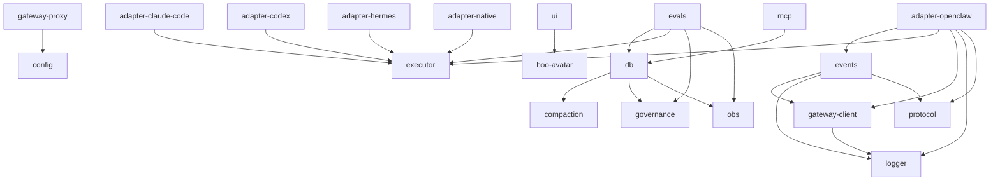

Clawboo is a TurboRepo + pnpm-workspaces monorepo. Every shared library lives under the `@clawboo/*` scope in `packages/`; all of them are **internal** (`private: true`); the only published npm artifact is the `clawboo` CLI (`apps/cli`), which inlines every `@clawboo/*` package it needs into its bundle (`dist/`). The two consumers are `apps/web` (the dashboard + Express API) and `apps/cli` (`clawboo`). Packages divide cleanly into **pure / browser-safe** ones (no `node:*` imports, safe to bundle into the Vite SPA or run in a worker) and **server-only** ones (touch `node:fs`/`node:http`/`better-sqlite3` and may only run in the Express server, the bundled CLI server, or the MCP stdio bins). Dependencies flow one way: apps depend on packages, packages depend on packages, and packages never import apps. `@clawboo/tsconfig` is the shared TypeScript-config root (a devDependency everywhere, no runtime edge).

There are **27 packages** (22 top-level + 5 nested adapters under `packages/adapters/*`). Versions diverge per package; most sit at `0.1.0`, `events` and `gateway-client` are at `0.1.1`, and `tsconfig` is `0.0.0`.

<Note>
"Purity" here describes the package's **imports**, not whether it ships to the browser. The five runtime adapters import nothing from `node:*` (they take injected driver factories; the real subprocess/SDK drivers live server-side in `apps/web/server/lib/runtimes/`), so they are import-pure even though they're consumed server-side.
</Note>

## At a glance

| Package                        | Version | Purity        | Purpose                                                                              | Page                                                           |
| ------------------------------ | ------- | ------------- | ------------------------------------------------------------------------------------ | -------------------------------------------------------------- |
| `@clawboo/agent-registry`      | 0.1.0   | pure zero-dep | `AgentSource` interface + `AgentRecord`/`TeamRecord`/`SessionRecord` + multiplexer   | [agent-registry](/reference/packages/agent-registry)           |
| `@clawboo/boo-avatar`          | 0.1.0   | pure zero-dep | Deterministic ghost-lobster SVG avatar generator                                     | [boo-avatar](/reference/packages/boo-avatar)                   |
| `@clawboo/capability-registry` | 0.1.0   | pure zero-dep | `CapabilityRecord` + `CapabilitySource` trait + multiplexer                          | [capability-registry](/reference/packages/capability-registry) |
| `@clawboo/compaction`          | 0.1.0   | pure zero-dep | Pass-through-safe, failure-preserving tool-output compaction                         | [compaction](/reference/packages/compaction)                   |
| `@clawboo/config`              | 0.1.0   | server-only   | Settings fallback chain + state-dir resolution (`node:fs`/`os`/`path`)               | [config](/reference/packages/config)                           |
| `@clawboo/control-client`      | 0.1.0   | browser-safe  | REST/SSE client for the control plane + the base-URL / auth-header seam              | [control-client](/reference/packages/control-client)           |
| `@clawboo/db`                  | 0.1.0   | server-only   | SQLite + Drizzle schema + board/memory/tools/governance/obs/sessions cores           | [db](/reference/packages/db)                                   |
| `@clawboo/evals`               | 0.1.0   | server-only   | Eval harness for Clawboo's own orchestration (pass@1 / pass^k + ablation)            | [evals](/reference/packages/evals)                             |
| `@clawboo/events`              | 0.1.1   | browser-safe  | Bridge → Policy → Handler event pipeline                                             | [events](/reference/packages/events)                           |
| `@clawboo/executor`            | 0.1.0   | pure zero-dep | `RuntimeAdapter` trait + `RuntimeEvent` union + registry + `./contract` + `./tiers`  | [executor](/reference/packages/executor)                       |
| `@clawboo/gateway-client`      | 0.1.1   | browser-safe  | WebSocket client for the OpenClaw Gateway                                            | [gateway-client](/reference/packages/gateway-client)           |
| `@clawboo/gateway-proxy`       | 0.1.0   | server-only   | Same-origin WS proxy + access gate + Ed25519 device auth                             | [gateway-proxy](/reference/packages/gateway-proxy)             |
| `@clawboo/governance`          | 0.1.0   | browser-safe  | Verdict schemas + severity policy + budget cent-math + caps + breaker                | [governance](/reference/packages/governance)                   |
| `@clawboo/logger`              | 0.1.0   | browser-safe  | pino wrapper + display-layer secret redaction                                        | [logger](/reference/packages/logger)                           |
| `@clawboo/mcp`                 | 0.1.0   | server-only   | Tasks/Memory/Tools/TeamChat MCP servers + stdio bins                                 | [mcp](/reference/packages/mcp)                                 |
| `@clawboo/obs`                 | 0.1.0   | browser-safe  | Orchestration-event schema + error taxonomy + graph projection + judge               | [obs](/reference/packages/obs)                                 |
| `@clawboo/protocol`            | 0.1.0   | pure zero-dep | Gateway message parser + transcript types + agent-file defs                          | [protocol](/reference/packages/protocol)                       |
| `@clawboo/scheduler`           | 0.1.0   | browser-safe  | Cron parsing + occurrence math + `ScheduleSource` trait + multiplexer                | [scheduler](/reference/packages/scheduler)                     |
| `@clawboo/team-orchestration`  | 0.1.0   | browser-safe  | The pure team-chat orchestration engine + `BoardClient` + nudge queue + `./contract` | [team-orchestration](/reference/packages/team-orchestration)   |
| `@clawboo/tsconfig`            | 0.0.0   | (config-only) | Shared TS configs (`base.json`, `react.json`, `node.json`)                           | [tsconfig](/reference/packages/tsconfig)                       |
| `@clawboo/ui`                  | 0.1.0   | browser-safe  | shadcn/ui primitives + `BooAvatar` + design tokens                                   | [ui](/reference/packages/ui)                                   |
| `@clawboo/worktrees`           | 0.1.0   | server-only   | Per-task git-worktree lifecycle + SoR scaffold + `AGENT_HANDOFF.json`                | [worktrees](/reference/packages/worktrees)                     |
| `@clawboo/adapter-claude-code` | 0.1.0   | browser-safe  | Claude Code `RuntimeAdapter` (pure; server driver injected)                          | [adapter-claude-code](/reference/packages/adapter-claude-code) |
| `@clawboo/adapter-codex`       | 0.1.0   | browser-safe  | Codex `RuntimeAdapter` (pure; server driver injected)                                | [adapter-codex](/reference/packages/adapter-codex)             |
| `@clawboo/adapter-hermes`      | 0.1.0   | browser-safe  | Hermes `RuntimeAdapter` (pure; server driver injected)                               | [adapter-hermes](/reference/packages/adapter-hermes)           |
| `@clawboo/adapter-native`      | 0.1.0   | browser-safe  | clawboo-native `RuntimeAdapter` + `AgentConfig` schema                               | [adapter-native](/reference/packages/adapter-native)           |
| `@clawboo/adapter-openclaw`    | 0.1.0   | browser-safe  | OpenClaw `RuntimeAdapter` over the Gateway client                                    | [adapter-openclaw](/reference/packages/adapter-openclaw)       |

## Dependency graph

Runtime `dependencies` only (`@clawboo/*` edges). `@clawboo/tsconfig` is a devDependency root, omitted from the runtime graph. Leaf nodes (`config`, `protocol`, `boo-avatar`, `agent-registry`, `capability-registry`, `compaction`, `executor`, `obs`, `scheduler`, `worktrees`) have no `@clawboo/*` runtime edges.

## Build order

Packages build before the apps that depend on them. Within each tier, packages have no `@clawboo/*` edge on a sibling in the same tier.

1. **`tsconfig` + `logger`**, the shared TS-config root and the base logger (`logger` has no `@clawboo/*` edge).
2. **`config` · `gateway-client` · `protocol` · `agent-registry`**; `gateway-client` depends on `logger`; the rest are pure/zero-dep.
3. **`events` · `db` · `gateway-proxy`**; `events` → `gateway-client`/`logger`/`protocol`; `gateway-proxy` → `config`; `db` → `compaction`/`governance`/`obs` (which build in tier 4 below; `db` is sequenced after them in practice).
4. **`executor` · `adapters/*` · `worktrees` · `compaction` · `scheduler` · `governance` · `obs`**; `executor` is pure (`./` + `./contract` + `./tiers`); the five adapters depend only on `executor` (`adapter-openclaw` also on `events`/`gateway-client`/`logger`/`protocol`); `compaction`/`obs`/`governance` are the dependencies `db` pulls in.
5. **`boo-avatar` + `ui`**; `ui` → `boo-avatar`.
6. **`mcp`**, depends on `db`; bundles its stdio bins.
7. **`apps/web` → `apps/cli`**; the web app consumes all 24 runtime packages; the CLI consumes only `config` (+ the `tsconfig` devDependency).

<Note>
The `db` ↔ `compaction`/`governance`/`obs` and `evals` ↔ `db`/`executor`/`governance`/`obs` edges mean tiers 3–4 are interleaved in dependency terms; Turbo resolves the exact topological order from each `package.json`. The tiers above are the human-readable grouping, not a strict serial sequence.
</Note>

## See also

- [Reference map](/reference/index)
- [Monorepo & build](/internals/monorepo-and-build)
- [The RuntimeAdapter trait](/internals/runtime-adapter)
- [AgentSource & registry of record](/internals/agent-source)
- [Database schema](/reference/database-schema)
