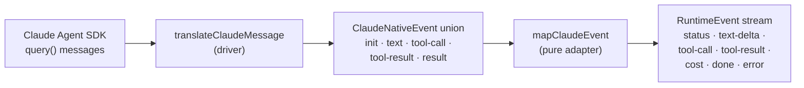

Use this page when you want a [Boo](/appendices/glossary) backed by **Claude Code**, Anthropic's coding agent. Clawboo wraps the [Claude Agent SDK](https://docs.claude.com/en/docs/claude-code/overview) so a Claude Code run executes a durable board task in its own [worktree](/appendices/glossary), reports up, and resumes across runs.

Claude Code is one of the four non-OpenClaw [runtimes](/appendices/glossary). Like the others, it is a [RuntimeAdapter](/appendices/glossary): Clawboo installs its CLI, stores your `ANTHROPIC_API_KEY` in the [encrypted vault](/runtimes/connecting-runtimes#where-keys-are-stored), and reports its connection state. This page covers the bits specific to Claude Code; for the shared install/connect/disconnect lifecycle see [Connecting runtimes](/runtimes/connecting-runtimes).

## Prerequisites

<Note>
Node 22+ and `npm` (bundled with Node); Claude Code installs via `npm install -g`. An Anthropic API key, **or** an existing local `claude` login (the SDK falls back to the logged-in CLI's own auth when no key is in the vault).
</Note>

- The Clawboo dashboard running (`clawboo`).
- A board task to run on, created via the [board](/concepts/the-board) (you can also drive it directly with `POST /api/runtimes/claude-code/run`).

## Capabilities

The adapter declares its `capabilities()` so the host routes the run by construction (it never branches on the runtime id). Claude Code's are:

| Capability                                         | Value                          | Meaning                                                                         |
| -------------------------------------------------- | ------------------------------ | ------------------------------------------------------------------------------- |
| `streaming`                                        | `true`                         | Emits incremental text deltas as the model writes                               |
| `mcp`                                              | `true`                         | Attaches Clawboo's hosted MCP servers (Tasks / Memory / Tools / TeamChat)       |
| `worktrees`                                        | `true`                         | File-mutating tasks run in an isolated git worktree                             |
| `resume`                                           | `true`                         | A later run can resume the prior native session                                 |
| `toolApproval`                                     | `true`                         | Surfaces tool-approval gates the host can resolve                               |
| `models`                                           | `['sonnet', 'opus', 'haiku']`  | The model families it accepts                                                   |
| `contextWindowTokens`                              | `200000`                       | Drives the proactive session-rotation watermark                                 |
| `runtimeClass`                                     | `'wrapped-oneshot'`            | A per-run spawned worker, not a long-lived substrate                            |
| `nativeSkills` / `nativeMemory` / `nativeChannels` | `'none'` / `'none'` / `'none'` | Stateless; the cognition is the model; no durable per-identity home to preserve |

Because `runtimeClass` is `wrapped-oneshot` and there is no `nativeHome` claim, the host provisions no persistent home for Claude Code. The SDK runs against your real `HOME` / Keychain auth; nothing native accrues per identity. (Contrast [Hermes](/runtimes/hermes), which keeps a persistent home that compounds skills and memory across runs.)

## Steps

### 1. Install the CLI

From the **Runtimes** panel, click **Install** on the Claude Code card. The card opens an SSE install stream that runs:

```bash
npm install -g @anthropic-ai/claude-code@2
```

The package is pinned to the current major (`@2`) so a future major-incompatible publish is never auto-installed. The health binary the panel probes for is `claude`. If `npm` is missing the stream emits an `error` with code `NPM_MISSING`.

<Warning>
A global npm install can hit `EACCES` on a system Node. The installer detects "permission denied" in stderr and suggests `sudo npm install -g @anthropic-ai/claude-code@2`; but prefer a Node version manager (nvm/fnm) or Homebrew over `sudo`.
</Warning>

### 2. Connect your key

Click **Connect** on the card (from the `needs-auth` state) and paste an Anthropic API key. The key is stored in the encrypted vault under `ANTHROPIC_API_KEY` and the card flips to `ready`. The connect response never echoes the key.

The equivalent REST call:

```bash
curl -X POST http://localhost:18790/api/runtimes/claude-code/connect \
  -H 'Content-Type: application/json' \
  -d '{"apiKey":"sk-ant-..."}'
```

<Tip>
You can skip the explicit Connect if a credential already resolves. At run time the key is resolved by `resolveRuntimeKey('ANTHROPIC_API_KEY')` in priority order: `process.env.ANTHROPIC_API_KEY` → the encrypted vault → OpenClaw's `~/.openclaw/.env`. If any of those holds the key, the card reads `ready` without a paste.
</Tip>

### 3. Run a board task on it

With the runtime `ready`, dispatch a board task:

```bash
curl -X POST http://localhost:18790/api/runtimes/claude-code/run \
  -H 'Content-Type: application/json' \
  -d '{"taskId":"<task-uuid>","repoPath":"/path/to/repo","kind":"code"}'
```

The server-side executor runner claims the task, provisions a worktree from `repoPath`, spawns the Claude Agent SDK with the connected key injected into the child env, drives the SDK's message stream as a normalized event stream, then writes the report-up summary and `AGENT_HANDOFF.json`. See the [`/api/runtimes/:id/run` reference](/reference/rest-api/runtimes#post-apiruntimesidrun) for the full request/response shape.

## How the driver works

The pure adapter lives in `@clawboo/adapter-claude-code`; the real driver that talks to the SDK lives server-side in `claudeCodeDriver.ts`. They are split deliberately so the adapter stays dependency-light (its only dependency is `@clawboo/executor`) and contract-testable against an in-memory fake.

### The SDK is lazy-imported

`@anthropic-ai/claude-agent-sdk` is **not** bundled into the shipped server and **not** required at boot. The driver imports it lazily, inside the run:

```ts
const mod = (await import('@anthropic-ai/claude-agent-sdk')) as unknown as SdkModule
```

A default Clawboo install therefore carries no Claude Code dependency in its boot graph; the SDK is loaded only when a Claude Code run actually starts. The driver's structural types are deliberately decoupled from the SDK's deep generated types (which reference a different zod major).

### Message translation

For each run the driver builds the SDK `query()` options from the run context: `cwd` (the worktree), `model`, `resume`, the MCP server config built from `mcpBaseUrl`, `disallowedTools` (the child tool blocklist), and a scrubbed child env with the provider key merged on top. It then translates each SDK message into the adapter's `ClaudeNativeEvent` union, which the pure `mapClaudeEvent` maps into the normalized `RuntimeEvent` stream:



The `system`/`init` message carries the native session id and model; `assistant` content blocks become `text` (and `thinking` blocks become reasoning-channel text); `tool_use` blocks become `tool-call`; tool results become `tool-result`; and the terminal `result` message becomes a `cost` event plus a `done` (or `error`) event.

### Real USD cost, passed through

Claude Code reports a real `total_cost_usd` per run. The mapper passes it straight through as a concrete `costUsd` on the `cost` and `done` events, not an estimate. (Contrast [Codex](/runtimes/codex), which emits no USD and is estimated.)

### `max_turns` is a clean terminal, not an error

When a run hits its turn ceiling the SDK signals `result.subtype === 'error_max_turns'`. The driver surfaces this as a distinct `maxTurns` flag, and the mapper emits a `done` event with `reason: 'max_turns'`, **not** an `error`. This is a clean "ran out of room" terminal. The host treats it as a rotation signal: it spins up a fresh successor session carrying a handoff note (not the heavy transcript) and continues, rather than failing the task. The 200k-token `contextWindowTokens` also drives a proactive watermark so the host can rotate _before_ the window fills, bounded by `maxRotations`.

### Session resume across runs

The adapter's `sessionCodec` serializes the native Claude session id (captured from the `init`/`result` frames). On a later same-runtime run, the executor runner threads that id back into the run context, and the driver sets the SDK's `resume` option, a genuine continuation of the prior session. A cross-runtime pickup (a different runtime resuming the task) rides the prose handoff in `AGENT_HANDOFF.json` instead.

### Headless permissions

The run is a headless worker, so the driver sets `permissionMode: 'bypassPermissions'` and `allowDangerouslySkipPermissions: true`. This is safe because Clawboo gates risky tools externally (the board, approvals) and the run is confined to an isolated per-task worktree; the SDK requires the explicit opt-in alongside `bypassPermissions`. The driver also strips Clawboo's own server secrets (gateway token, access-gate token, vault master key) from the child env before merging the provider key, so the spawned agent does not inherit them.

## Verify it worked

- The Runtimes card reads `ready` and `GET /api/runtimes` reports the Claude Code entry with `connectionState: "ready"` and `health.ok: true`. For a CLI runtime, `health` reflects whether the `claude` binary resolves on PATH or a known user-install dir.
- After a `POST /api/runtimes/claude-code/run`, the task advances on the board, the worktree carries the file changes plus an `AGENT_HANDOFF.json`, and the run's report-up summary lands as a board comment.

## Troubleshooting

<Warning>
**The run starts but cannot authenticate.** With no key in the vault, the SDK falls back to the logged-in `claude` CLI's auth, which lives under your real `HOME`/Keychain. If the Clawboo server runs with an isolated `HOME` (a sandboxed dev/e2e environment), that login is invisible. Set `ANTHROPIC_API_KEY` (env or vault) for deterministic API-key auth, or run the server at your normal `HOME`.
</Warning>

<Warning>
**A task keeps hitting `max_turns`.** This is not a failure; the run terminated cleanly because it exhausted its turn budget. The host rotates the session and continues. If the chain hits `maxRotations` without finishing, the task is released back to `todo` for a retry. Raise `maxRotations` on the run body to allow a longer chain.
</Warning>

<Danger>
**`POST /api/runtimes/claude-code/run` returns `409`.** The task could not be atomically claimed; another worker won it. Per the board's atomic-claim contract, a `409` is data, **not** a transient error: do not retry it. See [the board](/concepts/the-board).
</Danger>

## See also

- [Connecting runtimes](/runtimes/connecting-runtimes): install/connect/disconnect, the encrypted vault, healthchecks
- [Runtimes overview](/runtimes/index): the full capability matrix across all five runtimes
- [`/api/runtimes` reference](/reference/rest-api/runtimes): request/response shapes for run, connect, install
- [Codex](/runtimes/codex) · [Hermes](/runtimes/hermes) · [Clawboo Native](/runtimes/native): the other non-OpenClaw runtimes
- [OpenClaw](/runtimes/openclaw): the connected-substrate runtime (different model)
- [The board](/concepts/the-board): `taskId`, atomic claim, the 409-no-retry contract
