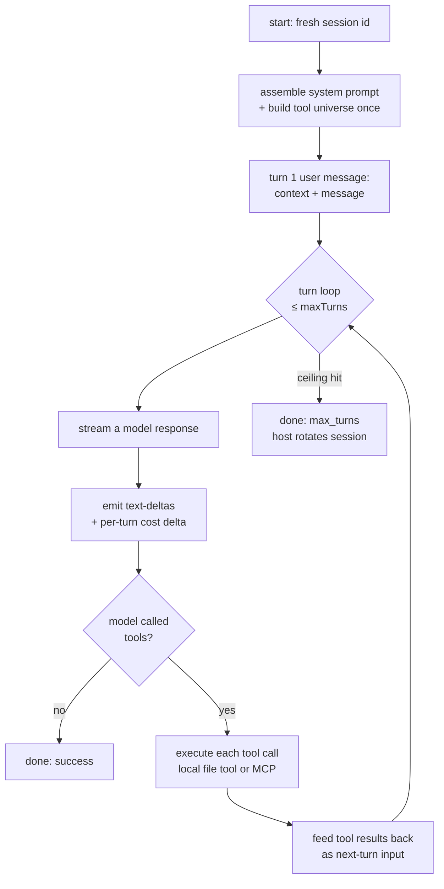

`clawboo-native` is Clawboo's own [runtime](/appendices/glossary): an in-process conversational harness that talks to provider SDKs directly (Anthropic, OpenAI, OpenRouter, Ollama) with **no OpenClaw Gateway** in the loop. It is one of the five runtimes, a co-equal peer beside `openclaw`, `claude-code`, `codex`, and `hermes`; there is no conversion or export between a native agent and any other runtime's agent.

Use this page to understand what the native runtime is, its capabilities and the shared MCP spine it consumes, its persistent per-identity home, its jailed file tools, how providers are routed and how fallback works, how a turn is priced, and how to connect it (paste a provider key; that is the entire setup, because nothing has to be installed).

## What it is

The native runtime is the only [RuntimeAdapter](/appendices/glossary) that _hosts_ its own conversation. The wrapped one-shot runtimes (`claude-code`, `codex`, `hermes`) re-shape a CLI or SDK subprocess's output into the normalized [RuntimeEvent](/appendices/glossary) stream; the native runtime instead runs an in-process turn loop, calling provider SDKs directly and emitting native events that map straight onto the same event shape.

Two consequences follow:

- **No install, no subprocess.** The adapter (`@clawboo/adapter-native`) and the server-side harness ship inside the Clawboo server. The descriptor marks it `builtIn: true` with `healthBin: null` and `installCommand: null`. There is nothing to install; connecting is purely pasting a provider key (or none, for Ollama).
- **No Gateway.** With a single pasted key, the native runtime runs Clawboo end-to-end: a leader delegates over the Tasks MCP, a specialist claims and works in a [worktree](/appendices/glossary), and the result lands on [the board](/concepts/the-board), all without an OpenClaw Gateway. The provider SDKs (`@anthropic-ai/sdk`, `openai`) are imported lazily inside the first turn, so booting the server costs nothing.

<Note>
The native runtime is a peer, not a substitute. Clawboo never migrates a `claude-code` / `codex` / `hermes` / `openclaw` agent *into* a native agent; the adapter package deliberately ships no cross-runtime agent-file mapping. A team can mix native agents with agents on any other runtime.
</Note>

## Capabilities

The native adapter reports the following capabilities. Callers branch on these (never on the runtime id), so they describe what the host may do with a native run.

| Capability            | Value                                                                | Meaning                                                                          |
| --------------------- | -------------------------------------------------------------------- | -------------------------------------------------------------------------------- |
| `streaming`           | `true`                                                               | Token deltas surface live                                                        |
| `mcp`                 | `true`                                                               | Attaches Clawboo's MCP servers in-process                                        |
| `worktrees`           | `true`                                                               | Gets an isolated git worktree for file-mutating tasks                            |
| `resume`              | `true`                                                               | A same-runtime resume reloads the prior transcript                               |
| `toolApproval`        | `true`                                                               | Tool calls go through the broker's approval pipeline                             |
| `models`              | `['claude-haiku-4-5', 'claude-sonnet-4-6', 'gpt-4o-mini', 'gpt-4o']` | A routable surface, not an exhaustive list; `AgentConfig` picks the actual model |
| `contextWindowTokens` | `200000`                                                             | Conservative floor across providers; drives the session-rotation watermark       |
| `runtimeClass`        | `'native'`                                                           | Resolves to the native-preservation integration plan                             |
| `nativeHome`          | `{ scope: 'per-identity', persist: true }`                           | A stable home that survives across runs                                          |
| `nativeMemory`        | `'preserve'`                                                         | The persisted transcript is its private cognitive plane                          |
| `nativeSkills`        | `'none'`                                                             | Capabilities ride the shared broker, not a native skills dir                     |
| `nativeChannels`      | `'none'`                                                             | The shared MCP spine is the only voice                                           |
| `nativeScheduler`     | `false`                                                              | The host owns when-to-run                                                        |

Because `runtimeClass` is `'native'` with `nativeHome: { scope: 'per-identity', persist: true }`, the integration planner resolves the run to a **persistent per-identity home** with `preserveMemory: true`. This is the [private plane](/appendices/glossary) the native runtime keeps: its conversation transcripts. Clawboo's [shared plane](/appendices/glossary) (board, memory, tools, team chat) is reached through MCP; the native runtime never co-runs its own scheduler.

## The agent config

A native agent is more than its registry row. Its behaviour is a normalized `AgentConfig`, persisted as JSON in a settings key-value row keyed by agent id (`native-agent-config:<agentId>`) and validated through a Zod schema on every load; a corrupt blob degrades to the default config instead of crashing a run.

```ts
interface AgentConfig {
  id: string
  name: string
  systemPrompt: string // the STABLE prompt tier (KV-cache safe)
  primaryProvider: string // 'anthropic' | 'openai' | 'openrouter' | 'ollama' | custom
  primaryModel: string
  fallbacks?: { provider: string; model: string }[]
  envVar: string // vault env-var NAME for the primary key (never the secret)
  tools: {
    memory: boolean // Memory MCP (shared facts)
    tools: boolean // Tools MCP / managed capability broker
    tasks: boolean // Tasks MCP / the durable board
    teamchat: boolean // TeamChat MCP — post + listen as a named peer
    custom?: string[] // reserved
  }
  participantKind: string // 'agent' today; open set
  maxTurns?: number // default 16
  budgetUsd?: number | null // null = system default; a set value mints an agent-scope hard-cap budget
  createdAt: number
  updatedAt: number
  tenantId: string | null // dormant multi-tenant seam — always null today
}
```

When the assigned agent id has no stored config (for example a board task assigned to an arbitrary id), the run falls back to a default config: provider `anthropic`, model `claude-haiku-4-5`, all four shared MCP tools on, `maxTurns` 16. The provider key still resolves through the host's vault chain.

A native agent is created through the native AgentSource; there is no Gateway and no provider SDK call at creation. The id is minted as `native-<slug>-<6 chars>`, the `AgentConfig` rides the registry input's `execConfig` (with `SOUL.md` as the `systemPrompt` fallback), and if `budgetUsd` is set, an agent-scope hard-cap budget is created at the same time.

## Providers and routing

A native run's candidate list is the agent's `primaryProvider` plus its declared `fallbacks`, each keyed by the conventional vault env var:

| Provider     | Env var              | Client                                                                                | Notes                                                            |
| ------------ | -------------------- | ------------------------------------------------------------------------------------- | ---------------------------------------------------------------- |
| `anthropic`  | `ANTHROPIC_API_KEY`  | Anthropic SDK (`messages.create`, streaming)                                          | Empty assistant text blocks are omitted (Anthropic rejects them) |
| `openai`     | `OPENAI_API_KEY`     | OpenAI SDK (Chat Completions, streaming)                                              | `api.openai.com` gets `max_completion_tokens`                    |
| `openrouter` | `OPENROUTER_API_KEY` | OpenAI SDK with `baseURL: https://openrouter.ai/api/v1`                               | Compat endpoint gets `max_tokens`                                |
| `ollama`     | _(keyless)_          | OpenAI SDK with `baseURL: <OLLAMA_BASE_URL>/v1` (default `http://localhost:11434/v1`) | No key needed                                                    |

The OpenAI client is also the carrier for OpenRouter and Ollama; both ride the exact same client with a base-URL override, so no extra dependency is needed. An unknown provider id with no base-URL convention is refused.

### Fallback

HTTP SDK construction can't fail, so fallback fires **per turn, at the first call failure**, and only _before anything was yielded_:

1. The active candidate streams a turn. If it fails with a fallback-worthy error (`auth`, `rate_limit`, `overloaded`, `network`) before yielding any output, the next candidate is tried.
2. Once a candidate yields, it is surfaced as-is; a mid-stream retry would duplicate the streamed text, so a mid-stream error propagates.
3. A working candidate becomes **sticky** for the rest of the conversation, and cost is attributed to the provider that actually served the turn.

Keyless non-Ollama candidates (a provider whose env var resolves to nothing) are dropped from the candidate list; there is nothing to authenticate with.

<Note>
Provider error codes are read structurally from the HTTP `.status` (`401`/`403` → `auth`, `429` → `rate_limit`, `5xx`/`529` → `overloaded`), never from SDK error-class names, so a provider SDK major-version bump can't break the routing logic.
</Note>

## The turn loop

Each `start()` is exactly one session: a fresh session id (`native-<uuid>`), a neutral message transcript, the routed provider client, and a tool universe. The loop runs up to `maxTurns` iterations:



Some loop properties worth knowing:

- **KV-cache discipline.** The system prompt is the stable tier (the agent's `systemPrompt` plus a _date-only_ stamp, never minute precision, which would bust the cache prefix). The tool universe is built **once** before turn 1 and sorted by name (deterministic order is a cache key). The caller-assembled run context (which already carries the volatile memory block in its tail) arrives as the first user message; nothing volatile ever enters the system prompt.
- **Per-turn cost.** Each completed provider response emits a `cost` event whose usage and USD are _that turn's deltas_, not a running total. The host's budget kill-switch therefore sees live spend mid-run, not one bill at the end. This is something the wrapped one-shot runtimes can't offer.
- **Terminals.** No tool calls → a clean `success` done. Hitting `maxTurns` is a clean `max_turns` terminal (the host rotates to a fresh successor session carrying a handoff note), distinct from a failure. An abort or a provider error ends the run too; and _every_ terminal persists the transcript.

## Built-in file tools

When a native run has a working directory (a worktree), it gets three built-in file tools, the runtime's [private plane](/appendices/glossary), the way every coding runtime ships its own file primitives. The shared MCP spine carries coordination, not workspace edits.

| Tool         | Purpose                                                                                  |
| ------------ | ---------------------------------------------------------------------------------------- |
| `read_file`  | Read a UTF-8 file relative to the workspace root (capped at 64 KiB; truncated past that) |
| `write_file` | Write a UTF-8 file (creates parent directories)                                          |
| `list_files` | List a directory's entries (default: the workspace root)                                 |

<Info>
The file tools are **strictly jailed to the run's worktree**. Every path is resolved under the working directory and must stay inside it; an absolute path or any `..` escape is rejected. A run with **no working directory** (a research or review task) gets **no file tools at all**; there is nothing to edit.
</Info>

## In-process MCP

The native runtime consumes Clawboo's shared MCP spine: Tasks, Memory, Tools, and TeamChat, _in-process_, without spawning a stdio server for it to call itself. Each enabled server is connected over a linked in-memory transport pair, held open for the conversation's lifetime; the servers wrap the same SQLite cores every other runtime reaches over HTTP or stdio, so the broker's availability, approval, and audit pipeline applies to native tool calls identically.

Which servers attach is driven by `AgentConfig.tools`:

- **Tasks** (`tasks`): the durable board.
- **Memory** (`memory`): shared facts. The run's authoritative memory scope (team id plus agent id) is bound onto the in-process Memory server, so native saves are team-shared and reads are team-limited, matching the HTTP-attached runtimes. The native server carries vectors too (hybrid search parity with every other runtime).
- **Tools** (`tools`): the managed capability broker.
- **TeamChat** (`teamchat`): posting and listening in the shared team room as a named peer. It binds the author identity from the run (anti-spoof) and requires both an agent id and a team.

Tool names are served unprefixed (they are distinct across the servers), with a routing map remembering which server owns each name; a duplicate name registered later is skipped so routing stays unambiguous. The combined tool universe (local file tools plus the MCP tools, minus any child-tool blocklist) is what the model sees; and because the native runtime hosts its own loop, it genuinely _enforces_ the blocklist: a stripped tool is invisible to the model.

## The per-identity home

A native agent's conversation transcripts live in a **stable per-identity home** that the host materializes once at `<clawboo home>/runtimes/clawboo-native/<sanitized agentId>/`. Each terminal persists the transcript to `<home>/sessions/<sessionId>.json`, and a matching `sessions` table row (source id `clawboo-native`) is upserted so the registry's session list has data.

This is what makes `resume: true` real for the native runtime. A same-runtime resume reloads the prior transcript from the home, a genuine continuation of the conversation, not just lineage. A run with no home (an ephemeral integration plan) simply no-ops the persistence; continuity then rides the prose handoff note instead.

<Note>
The verification critic deliberately runs *without* a home; builder ≠ judge, so the reviewer must not share the builder's persisted transcripts. See [Verification](/concepts/verification).
</Note>

## How to connect

The native runtime is built in, so it never reaches the `not-installed` state; connecting is entirely a key (or, for Ollama, nothing). The full connect/disconnect/healthcheck mechanics are shared with the other runtimes; see [Connecting runtimes](/runtimes/connecting-runtimes) for the card UI, the encrypted vault, and the resolution chain. The native specifics:

### 1. (Optional) Verify a key before committing

`POST /api/runtimes/clawboo-native/healthcheck` with `{ provider, apiKey }` makes a single authenticated `GET` to the provider's models/health endpoint (`anthropic` → `https://api.anthropic.com/v1/models`, `openai` → `https://api.openai.com/v1/models`, `openrouter` → `https://openrouter.ai/api/v1/models`, `ollama` → `<OLLAMA_BASE_URL>/api/tags`, keyless), bounded by an 8-second timeout. It returns `{ ok: true }` on a 2xx or `{ ok: false, error }` on a bad key (`401`/`403` → `"Invalid API key."`), a timeout, or a network failure. **The key is used for that one fetch only, never persisted, never logged, never echoed.** This route is native-only; any other runtime id returns `400`.

```bash
curl -X POST http://localhost:18790/api/runtimes/clawboo-native/healthcheck \
  -H 'Content-Type: application/json' \
  -d '{"provider":"anthropic","apiKey":"sk-ant-..."}'
```

### 2. Connect the key

`POST /api/runtimes/clawboo-native/connect` with `{ apiKey, provider? }` stores the key in the encrypted vault, keyed by env var. The native runtime is multi-provider, so the optional `provider` field routes the key to the right slot:

| `provider`                 | Vault env var written                |
| -------------------------- | ------------------------------------ |
| _(omitted)_ or `anthropic` | `ANTHROPIC_API_KEY`                  |
| `openai`                   | `OPENAI_API_KEY`                     |
| `openrouter`               | `OPENROUTER_API_KEY`                 |
| `ollama`                   | _(keyless, nothing stored, a no-op)_ |

The provider is validated against the runtime's known env-var set (`ANTHROPIC_API_KEY` plus its `altEnvVars`); an unrecognized provider falls back to the default `ANTHROPIC_API_KEY`. The response never echoes the key.

```bash
# Anthropic (the default slot)
curl -X POST http://localhost:18790/api/runtimes/clawboo-native/connect \
  -H 'Content-Type: application/json' \
  -d '{"apiKey":"sk-ant-..."}'

# OpenRouter
curl -X POST http://localhost:18790/api/runtimes/clawboo-native/connect \
  -H 'Content-Type: application/json' \
  -d '{"apiKey":"sk-or-...","provider":"openrouter"}'
```

### 3. Seed a starter team (first-run path)

`POST /api/onboarding/seed-native-team` with `{ provider?, model? }` mints a default native team, a leader (`tasks` tool on, capable model) and a specialist (cheap model), so a first-run user who just connected a key lands in a working team. Both agents are `clawboo-native` rows created through the native AgentSource (no Gateway, no provider SDK call). Per-provider model defaults: `anthropic` → `claude-sonnet-4-6` / `claude-haiku-4-5`; `openai` → `gpt-4o` / `gpt-4o-mini`; `openrouter` → `anthropic/claude-haiku-4.5` / `openai/gpt-4o-mini`; `ollama` → `llama3.2` / `llama3.2`.

```bash
curl -X POST http://localhost:18790/api/onboarding/seed-native-team \
  -H 'Content-Type: application/json' \
  -d '{"provider":"anthropic"}'
```

## Verify it worked

- `GET /api/runtimes` should show the `clawboo-native` entry with `installed: true`, `binPath: null`, and `connectionState: "ready"`. Its `health.ok` is `true` when **any** routable provider key (`ANTHROPIC_API_KEY`, `OPENAI_API_KEY`, or `OPENROUTER_API_KEY`) resolves, or `OLLAMA_BASE_URL` is set, no binary probe, no network call.
- Run a board task on it via `POST /api/runtimes/clawboo-native/run`. Every resolvable provider key is injected from the vault into the run, so a key connected from the UI authenticates automatically.

## Troubleshooting

<Warning>
**`clawboo-native` reads as not connected even though you connected a key.** Native health is provider-key presence, not a binary. Confirm the key landed in the *expected* vault slot: an OpenAI or OpenRouter key connected without the `provider` field is written to `ANTHROPIC_API_KEY`. Re-connect with the matching `provider`. A key exported in the server's environment, or present in OpenClaw's `~/.openclaw/.env`, also satisfies the check (the resolution chain falls back to both).
</Warning>

<Warning>
**A run reports `costUsd: null`.** Native pricing is an exact-match table for the pinned models (`claude-haiku-4-5`, `claude-sonnet-4-6`, `gpt-4o-mini`, `gpt-4o`, plus the OpenRouter aliases for the Anthropic/OpenAI pins). Any other model is honestly reported as `costUsd: null, estimated: true` rather than priced as a fabricated default. A trailing `-YYYYMMDD` date suffix is normalized before lookup.
</Warning>

<Danger>
**Ollama is keyless and local.** `provider: "ollama"` stores nothing, and the run reaches the model at `<OLLAMA_BASE_URL>/v1` (default `http://localhost:11434/v1`). If Ollama is not running there, the provider call fails like any unreachable endpoint.
</Danger>

## Related

- [Connecting runtimes](/runtimes/connecting-runtimes), the install/connect/disconnect lifecycle and the encrypted vault
- [Runtimes overview](/runtimes/index), the capability matrix across all five runtimes
- [`/api/runtimes` reference](/reference/rest-api/runtimes), full request/response shapes for connect, healthcheck, run, and seed-native-team
- [Quickstart: native-first](/getting-started/quickstart-native), paste a key and land in a team with no Gateway
- [The board](/concepts/the-board), the durable task substrate a native run drives
- [Memory](/concepts/memory), the shared facts tier a native run reads and writes over MCP
- [Teams and planes](/concepts/teams-and-planes), the shared-plane / private-plane split
- [Environment variables](/reference/environment-variables), `CLAWBOO_HOME`, `OLLAMA_BASE_URL`, provider keys
