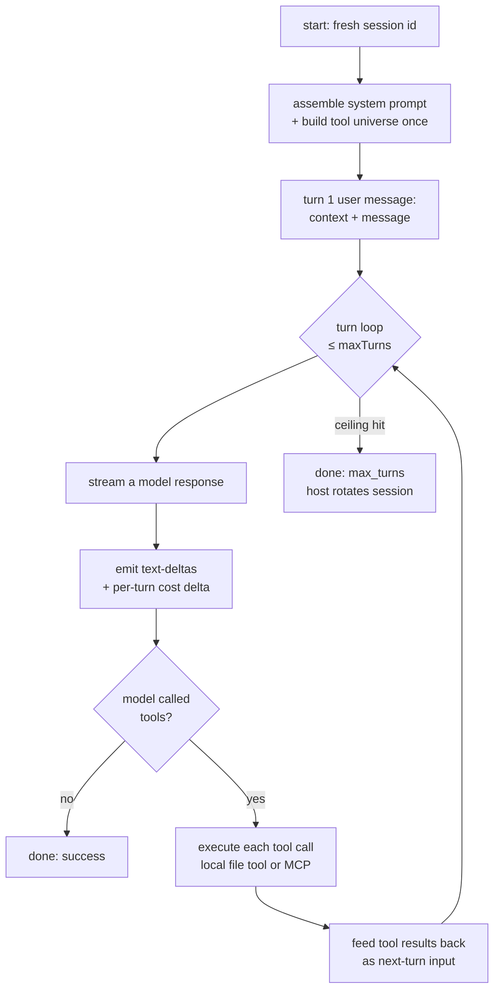

`clawboo-native` is Clawboo's own [runtime](/appendices/glossary): an in-process conversational harness that talks to provider SDKs directly (Anthropic, OpenAI, OpenRouter, Ollama, plus seven more OpenAI-compatible providers) with **no OpenClaw Gateway** in the loop. It is one of the five runtimes, a co-equal peer beside `openclaw`, `claude-code`, `codex`, and `hermes`; there is no conversion or export between a native agent and any other runtime's agent.

Use this page to understand what the native runtime is, its capabilities and the shared MCP spine it consumes, its persistent per-identity home, its jailed file tools, the approval-gated shell a board task can switch on, how providers are routed and how fallback works, how a turn is priced, and how to connect it (paste a provider key; that is the entire setup, because nothing has to be installed).

## What it is

The native runtime is the only [RuntimeAdapter](/appendices/glossary) that _hosts_ its own conversation. The wrapped one-shot runtimes (`claude-code`, `codex`, `hermes`) re-shape a CLI or SDK subprocess's output into the normalized [RuntimeEvent](/appendices/glossary) stream; the native runtime instead runs an in-process turn loop, calling provider SDKs directly and emitting native events that map straight onto the same event shape.

Two consequences follow:

- **No install, no subprocess.** The adapter (`@clawboo/adapter-native`) and the server-side harness ship inside the Clawboo server. The descriptor marks it `builtIn: true` with `healthBin: null` and `installCommand: null`. There is nothing to install; connecting is purely pasting a provider key (or none, for Ollama).
- **No Gateway.** With a single pasted key, the native runtime runs Clawboo end-to-end: a leader delegates over the Tasks MCP, a specialist claims and works in a [worktree](/appendices/glossary), and the result lands on [the board](/concepts/the-board), all without an OpenClaw Gateway. The provider SDKs (`@anthropic-ai/sdk`, `openai`) are imported lazily inside the first turn, so booting the server costs nothing.

<Note>
The native runtime is a peer, not a substitute. Clawboo never migrates a `claude-code` / `codex` / `hermes` / `openclaw` agent *into* a native agent; the adapter package deliberately ships no cross-runtime agent-file mapping. A team can mix native agents with agents on any other runtime.
</Note>

## Capabilities

The native adapter reports the following capabilities. Callers branch on these (never on the runtime id), so they describe what the host may do with a native run.

| Capability            | Value                                                                | Meaning                                                                          |
| --------------------- | -------------------------------------------------------------------- | -------------------------------------------------------------------------------- |
| `streaming`           | `true`                                                               | Token deltas surface live                                                        |
| `mcp`                 | `true`                                                               | Attaches Clawboo's MCP servers in-process                                        |
| `worktrees`           | `true`                                                               | Gets an isolated git worktree for file-mutating tasks                            |
| `resume`              | `true`                                                               | A same-runtime resume reloads the prior transcript                               |
| `toolApproval`        | `true`                                                               | Tool calls go through the broker's approval pipeline                             |
| `models`              | `['claude-haiku-4-5', 'claude-sonnet-4-6', 'gpt-4o-mini', 'gpt-4o']` | A routable surface, not an exhaustive list; `AgentConfig` picks the actual model |
| `contextWindowTokens` | `200000`                                                             | Conservative floor across providers; drives the session-rotation watermark       |
| `runtimeClass`        | `'native'`                                                           | Resolves to the native-preservation integration plan                             |
| `nativeHome`          | `{ scope: 'per-identity', persist: true }`                           | A stable home that survives across runs                                          |
| `nativeMemory`        | `'preserve'`                                                         | The persisted transcript is its private cognitive plane                          |
| `nativeSkills`        | `'none'`                                                             | Capabilities ride the shared broker, not a native skills dir                     |
| `nativeChannels`      | `'none'`                                                             | The shared MCP spine is the only voice                                           |
| `nativeScheduler`     | `false`                                                              | The host owns when-to-run                                                        |

Because `runtimeClass` is `'native'` with `nativeHome: { scope: 'per-identity', persist: true }`, the integration planner resolves the run to a **persistent per-identity home** with `preserveMemory: true`. This is the [private plane](/appendices/glossary) the native runtime keeps: its conversation transcripts. Clawboo's [shared plane](/appendices/glossary) (board, memory, tools, team chat) is reached through MCP; the native runtime never co-runs its own scheduler.

## The agent config

A native agent is more than its registry row. Its behaviour is a normalized `AgentConfig`, persisted as JSON in a settings key-value row keyed by agent id (`native-agent-config:<agentId>`) and validated through a Zod schema on every load; a corrupt blob degrades to the default config instead of crashing a run.

```ts
interface AgentConfig {
  id: string
  name: string
  systemPrompt: string // the STABLE prompt tier (KV-cache safe)
  primaryProvider: string // one of the 11 KNOWN_PROVIDERS ids (see the routing table)
  primaryModel: string
  fallbacks?: { provider: string; model: string }[]
  envVar: string // vault env-var NAME for the primary key (never the secret)
  tools: {
    memory: boolean // Memory MCP (shared facts)
    tools: boolean // Tools MCP / managed capability broker
    tasks: boolean | 'read' // Tasks MCP / the durable board; 'read' attaches only list_tasks + get_task
    teamchat: boolean // TeamChat MCP — post + listen as a named peer
    shell?: boolean // the run_command tool; optional, and absent from the defaults, so absent means off
    custom?: string[] // reserved
  }
  participantKind: string // 'agent' today; open set
  maxTurns?: number // default 16
  budgetUsd?: number | null // null = system default; a set value mints an agent-scope hard-cap budget
  createdAt: number
  updatedAt: number
  tenantId: string | null // dormant multi-tenant seam — always null today
}
```

When the assigned agent id has no stored config (for example a board task assigned to an arbitrary id), the run falls back to a default config: provider `anthropic`, model `claude-haiku-4-5`, `maxTurns` 16, and Memory, Tools and TeamChat on with Tasks attached read-only. Board writes are deliberate, never a fallback: a team agent silently defaulting to full board access would race the orchestrator's claims. The provider key still resolves through the host's vault chain.

A native agent is created through the native AgentSource; there is no Gateway and no provider SDK call at creation. The id is minted as `native-<slug>-<6 chars>`, the `AgentConfig` rides the registry input's `execConfig` (with `SOUL.md` as the `systemPrompt` fallback), and if `budgetUsd` is set, an agent-scope hard-cap budget is created at the same time.

## Providers and routing

A native run's candidate list is the agent's `primaryProvider` plus its declared `fallbacks`, each keyed by the conventional vault env var:

| Provider     | Env var              | Client                                                                                | Notes                                                            |
| ------------ | -------------------- | ------------------------------------------------------------------------------------- | ---------------------------------------------------------------- |
| `anthropic`  | `ANTHROPIC_API_KEY`  | Anthropic SDK (`messages.create`, streaming)                                          | Empty assistant text blocks are omitted (Anthropic rejects them) |
| `openai`     | `OPENAI_API_KEY`     | OpenAI SDK (Chat Completions, streaming)                                              | `api.openai.com` gets `max_completion_tokens`                    |
| `openrouter` | `OPENROUTER_API_KEY` | OpenAI SDK with `baseURL: https://openrouter.ai/api/v1`                               | Compat endpoint gets `max_tokens`                                |
| `ollama`     | _(keyless)_          | OpenAI SDK with `baseURL: <OLLAMA_BASE_URL>/v1` (default `http://localhost:11434/v1`) | No key needed                                                    |
| `google`     | `GEMINI_API_KEY`     | OpenAI SDK with `baseURL: https://generativelanguage.googleapis.com/v1beta/openai`    | Google                                                           |
| `xai`        | `XAI_API_KEY`        | OpenAI SDK with `baseURL: https://api.x.ai/v1`                                        | xAI                                                              |
| `groq`       | `GROQ_API_KEY`       | OpenAI SDK with `baseURL: https://api.groq.com/openai/v1`                             | Groq                                                             |
| `mistral`    | `MISTRAL_API_KEY`    | OpenAI SDK with `baseURL: https://api.mistral.ai/v1`                                  | Mistral                                                          |
| `together`   | `TOGETHER_API_KEY`   | OpenAI SDK with `baseURL: https://api.together.xyz/v1`                                | Together                                                         |
| `cerebras`   | `CEREBRAS_API_KEY`   | OpenAI SDK with `baseURL: https://api.cerebras.ai/v1`                                 | Cerebras                                                         |
| `moonshot`   | `MOONSHOT_API_KEY`   | OpenAI SDK with `baseURL: https://api.moonshot.ai/v1`                                 | Moonshot                                                         |

The OpenAI client is also the carrier for OpenRouter, Ollama, and the seven extra providers; they all ride the exact same client with a base-URL override, so no extra dependency is needed. The last seven are resolved through one registry (`NATIVE_COMPAT_PROVIDERS`), which the router, the live-model fetcher, and the key-health probe all read. An unknown provider id with no base-URL convention is refused.

### Fallback

HTTP SDK construction can't fail, so fallback fires **per turn, at the first call failure**, and only _before anything was yielded_:

1. The active candidate streams a turn. If it fails with a fallback-worthy error (`auth`, `rate_limit`, `overloaded`, `network`) before yielding any output, the next candidate is tried.
2. Once a candidate yields, it is surfaced as-is; a mid-stream retry would duplicate the streamed text, so a mid-stream error propagates.
3. A working candidate becomes **sticky** for the rest of the conversation, and cost is attributed to the provider that actually served the turn.

Keyless non-Ollama candidates (a provider whose env var resolves to nothing) are dropped from the candidate list; there is nothing to authenticate with.

<Note>
Provider error codes are read structurally from the HTTP `.status` (`401`/`403` → `auth`, `429` → `rate_limit`, `5xx`/`529` → `overloaded`), never from SDK error-class names, so a provider SDK major-version bump can't break the routing logic.
</Note>

## The turn loop

Each `start()` is exactly one session: a fresh session id (`native-<uuid>`), a neutral message transcript, the routed provider client, and a tool universe. The loop runs up to `maxTurns` iterations:


```mermaid
flowchart TD
    A[start: fresh session id] --> B[assemble system prompt<br/>+ build tool universe once]
    B --> C[turn 1 user message:<br/>context + message]
    C --> D{turn loop<br/>≤ maxTurns}
    D --> E[stream a model response]
    E --> F[emit text-deltas<br/>+ per-turn cost delta]
    F --> G{model called<br/>tools?}
    G -->|no| H[done: success]
    G -->|yes| I[execute each tool call<br/>local file tool or MCP]
    I --> J[feed tool results back<br/>as next-turn input]
    J --> D
    D -->|ceiling hit| K[done: max_turns<br/>host rotates session]
```

Some loop properties worth knowing:

- **KV-cache discipline.** The system prompt is the stable tier (the agent's `systemPrompt` plus a _date-only_ stamp, never minute precision, which would bust the cache prefix). The tool universe is built **once** before turn 1 and sorted by name (deterministic order is a cache key). The caller-assembled run context (which already carries the volatile memory block in its tail) arrives as the first user message; nothing volatile ever enters the system prompt.
- **Per-turn cost.** Each completed provider response emits a `cost` event whose usage and USD are _that turn's deltas_, not a running total. The host's budget kill-switch therefore sees live spend mid-run, not one bill at the end. This is something the wrapped one-shot runtimes can't offer.
- **Terminals.** No tool calls → a clean `success` done. Hitting `maxTurns` is a clean `max_turns` terminal (the host rotates to a fresh successor session carrying a handoff note), distinct from a failure. An abort or a provider error ends the run too; and _every_ terminal persists the transcript.

## Built-in file tools

When a native run has a working directory (a worktree), it gets three built-in file tools, the runtime's [private plane](/appendices/glossary), the way every coding runtime ships its own file primitives. The shared MCP spine carries coordination, not workspace edits. A fourth local tool, `run_command`, joins them only when someone switched the shell on for that Boo; see [Running commands](#running-commands).

| Tool         | Purpose                                                                                  |
| ------------ | ---------------------------------------------------------------------------------------- |
| `read_file`  | Read a UTF-8 file relative to the workspace root (capped at 64 KiB; truncated past that) |
| `write_file` | Write a UTF-8 file (creates parent directories)                                          |
| `list_files` | List a directory's entries (default: the workspace root)                                 |

<Info>
The file tools are **strictly jailed to the run's worktree**. Every path is resolved under the working directory and must stay inside it; an absolute path or any `..` escape is rejected. A run with **no working directory** (a research or review task) gets **no file tools at all**; there is nothing to edit.
</Info>

## Running commands

`run_command` lets a native Boo propose running **one program** in its working folder. It is the only way a native Boo can run anything at all, and every single command is put in front of a person before it runs.

### Every precondition for the tool to exist

All four must hold, or `run_command` is simply **absent** from the model's tool list rather than present and refusing:

1. **The shell is switched on for that Boo**, `AgentConfig.tools.shell === true`. The field is optional and deliberately absent from the default config, so absent reads as off and a shell never arrives switched on.
2. **The run has a working directory.** In practice that means a **board task with a provisioned worktree**. A 1:1 chat, a team-room turn and a dispatch turn carry no working directory, so the tool is absent there. (The post-task verification critic does get one, but it runs under the default config with the switch off.)
3. **The host is not Windows.** See [Windows has no shell at all](#windows-has-no-shell-at-all).
4. **The run is a `clawboo-native` run.** `run_command` is a **local** tool, dispatched by the native conversation loop rather than registered with the capability broker, precisely so it cannot appear inside a `claude-code`, `codex`, `hermes` or `openclaw` agent. It is not an MCP tool and is not listed in [MCP tools](/reference/mcp-tools).

### The switch

Agent detail, the **Permissions** tab (which appears for native and OpenClaw Boos only), under **Running commands**.

- The switch reads **"Let this Boo ask to run commands"**, with the helper line "You are asked before every command. Nothing is remembered, so a command you allowed once will ask again the next time."
- Turning it on raises a confirm dialog titled **"Let this Boo ask to run commands?"**, with the body "It will be able to propose running programs on this computer. You are asked to approve every command before it runs, and nothing is remembered, so you will see each one." The confirm button reads **"Allow it to ask"**.
- Once it is on, the card adds: "Commands run in this Boo's working folder, as you, with access to the network. One program at a time: it cannot use pipes, redirects, or a shell."

The same setting over REST: `GET /api/agents/:agentId/shell` returns `{ enabled }`, and `POST /api/agents/:agentId/shell` with `{ enabled: boolean }` changes it. The POST is rate-limited, and it re-reads the stored config after writing, so the response is what is actually stored rather than what was asked for. Both routes answer `400` for a Boo on any other runtime: an OpenClaw Boo's shell is governed by its Gateway policy instead.

<Note>
The confirm dialog is **browser-side only**. `POST /api/agents/:agentId/shell` accepts `{ "enabled": true }` directly, and `POST /api/agents` with `sourceId: 'clawboo-native'` can set `execConfig.tools.shell` at creation. So: every native Boo created through clawboo's own screens starts with the shell off.
</Note>

### The tool contract

- Input is `argv` (an array of strings, required) and `why` (a string, optional: "One short sentence on why this command is needed").
- **argv only.** The program and each argument are separate array items, never one string, and the child is spawned with `shell: false`, always. There are no pipes, no redirects and no shell operators.
- **A person is asked every single time, and nothing is remembered.** There is no allowlist at this tier, so the card never offers **Always**: an "Always" that behaved as an allow-once would be a control that lies.
- **One run may ask about 10 commands.** The next call is refused without reaching anyone.
- **The card stays answerable for 10 minutes.**
- **Output is capped at 64 KiB**, stdout and stderr in arrival order, and the result says when the tail was dropped. A command is never killed merely for being chatty.
- A **non-zero exit is returned as an error result with the output still attached**. A command stopped by a signal has no exit code, and the result then opens with `The command finished with exit code unknown.`
- A command that runs past five minutes is stopped: SIGTERM to the process group, escalating to **SIGKILL after a 3 second** grace window. Stopping the run kills it the same way.

What the approval card shows: the headline `<Boo> wants to run a command on this computer.`, the chip "Runs a command", the **Command** and the **Folder** inline (never behind the disclosure), and an allow button reading **"Run it"**. See [Approvals](/using/approvals) for answering one.

### Refused before anyone is asked

These never reach a person. They come back to the model as a plain error so it can rephrase, and are not recorded as a human refusal:

- An `argv` that is not a non-empty array of strings, holds more than 64 items, or carries an item over 2048 bytes.
- Any control character in an argument. A NUL would truncate the string at the syscall boundary, so what a person read on the card and what the kernel receives would differ.
- An `argv[0]` carrying a path separator without being an absolute path: a bare program name or an absolute path, nothing in between.
- A program that resolves to a denylisted name, or a script whose shebang names one.

### Program resolution

Before the approval row is written, clawboo resolves the program with `realpath` against the **child's** `PATH`, applies the denylist to the **resolved** basename, reads the file's first line and checks **both** of the first two shebang words (so `#!/usr/bin/env python3` cannot hide the interpreter in the second word), and records the file's identity (device, inode, size, and both timestamps). The **resolved path is what gets spawned**, so the program named on the card is the program that runs. That identity is re-checked immediately before the spawn, so a binary swapped while the card waits is not run. It narrows the window rather than closing it: the file can still change between that last check and the spawn.

The denylist is 59 basenames in six groups: shells, run-another-program wrappers, interpreters, package runners, build tools whose job is running shell recipes, and anything that runs a command on another machine or in a container. Matching strips version suffixes, so `python3.11` and `node22` are caught alongside `python` and `node`.

<Danger>
**The denylist is a speed bump, not a sandbox.** `git -c core.pager=...`, `find -exec` and `awk 'BEGIN{system(...)}'` all reach a shell without appearing on it, and a test in the repo pins those shapes as **accepted** so that no future reader mistakes the list for a boundary. The list only removes the commands whose effect a person could not have read off the card. **The human answering the card is the boundary.** Nothing sandboxes an approved command: it runs on this computer, in the Boo's working folder, as the user running clawboo, with access to the network.
</Danger>

### The child process

- The child gets an **allowlist** environment, not the server's ambient one. On a Unix host the names that pass through are `PATH`, `HOME`, `SHELL`, `LANG`, `LC_ALL`, `LC_CTYPE`, `TZ`, `TMPDIR`, `LOGNAME`, `TERM`, `USER`, and the proxy variables.
- **Provider credentials are not forwarded**, so an approved `printenv` does not return your API keys.
- It runs in the Boo's working folder, as the user running clawboo, with network access.

### Windows has no shell at all

On Windows the tool is **absent, not degraded**. A Windows shim cannot be launched without a shell, and launching a shell is the property this design refuses, so `run_command` is never offered on a Windows host. The switch and its routes still work there; the tool simply never appears in a run.

### Honest limits

- **The card does not show the Boo's stated reason.** `why` is stored on the approval row, but the shell card carries no agent note: what you see is the command and the folder, and nothing about why the Boo wants it.
- **Declining can end the task, not just the command.** A refusal latches the tool for the rest of the run, and the next attempt is a second policy denial in a row, which trips the run's repeat-denial breaker and aborts the board task. An unanswered card sets the same latch, but the expiry itself is not recorded as a denial, so it takes two later attempts rather than one to trip the breaker.
- **A card nobody answers blocks the run** for the full 10 minutes, and the run makes no other progress while it waits.
- **The ceiling and the latch are per driver run, not per task.** A task that is re-driven starts again at zero asks, with the latch cleared.
- **No audit row is written for a `run_command` execution**, so it never appears in `GET /api/tools/audit`. The approval itself is an ordinary row in the approvals queue.

## In-process MCP

The native runtime consumes Clawboo's shared MCP spine: Tasks, Memory, Tools, and TeamChat, _in-process_, without spawning a stdio server for it to call itself. Each enabled server is connected over a linked in-memory transport pair, held open for the conversation's lifetime; the servers wrap the same SQLite cores every other runtime reaches over HTTP or stdio, so the broker's availability, approval, and audit pipeline applies to native tool calls identically.

Which servers attach is driven by `AgentConfig.tools`:

- **Tasks** (`tasks`): the durable board.
- **Memory** (`memory`): shared facts. The run's authoritative memory scope (team id plus agent id) is bound onto the in-process Memory server, so native saves are team-shared and reads are team-limited, matching the HTTP-attached runtimes. The native server carries vectors too (hybrid search parity with every other runtime).
- **Tools** (`tools`): the managed capability broker.
- **TeamChat** (`teamchat`): posting and listening in the shared team room as a named peer. It binds the author identity from the run (anti-spoof) and requires both an agent id and a team.

Tool names are served unprefixed (they are distinct across the servers), with a routing map remembering which server owns each name; a duplicate name registered later is skipped so routing stays unambiguous. The combined tool universe (local file tools plus the MCP tools, minus any child-tool blocklist) is what the model sees; and because the native runtime hosts its own loop, it genuinely _enforces_ the blocklist: a stripped tool is invisible to the model.

## The per-identity home

A native agent's conversation transcripts live in a **stable per-identity home** that the host materializes once at `<clawboo home>/runtimes/clawboo-native/<sanitized agentId>/`. Each terminal persists the transcript to `<home>/sessions/<sessionId>.json`, and a matching `sessions` table row (source id `clawboo-native`) is upserted so the registry's session list has data.

This is what makes `resume: true` real for the native runtime. A same-runtime resume reloads the prior transcript from the home, a genuine continuation of the conversation, not just lineage. A run with no home (an ephemeral integration plan) simply no-ops the persistence; continuity then rides the prose handoff note instead.

<Note>
The verification critic deliberately runs *without* a home; builder ≠ judge, so the reviewer must not share the builder's persisted transcripts. See [Verification](/concepts/verification).
</Note>

## How to connect

The native runtime is built in, so it never reaches the `not-installed` state; connecting is entirely a key (or, for Ollama, nothing). The full connect/disconnect/healthcheck mechanics are shared with the other runtimes; see [Connecting runtimes](/runtimes/connecting-runtimes) for the card UI, the encrypted vault, and the resolution chain. The native specifics:

### 1. Verify a key before committing

`POST /api/runtimes/clawboo-native/healthcheck` with `{ provider, apiKey? }` makes a single authenticated `GET` to the provider's models/health endpoint (`anthropic` → `https://api.anthropic.com/v1/models`, `openai` → `https://api.openai.com/v1/models`, `openrouter` → `https://openrouter.ai/api/v1/models`, an extra OpenAI-compatible provider → its own `<baseURL>/models`, `ollama` → `<OLLAMA_BASE_URL>/api/tags`, keyless), bounded by an 8-second timeout. It returns `{ ok: true }` on a 2xx or `{ ok: false, error }` on a bad key (`401`/`403` → `"Invalid API key."`), a timeout, or a network failure. **The key is used for that one fetch only, never persisted, never logged, never echoed.** This route is native-only; any other runtime id returns `400`.

`apiKey` is optional. Omit it to check the key already stored for that provider — that's how the Providers manager's one-click **Use** confirms a saved key still works before reconnecting on it. With no `apiKey` and nothing stored, the route returns `400`.

The UI does not treat this as an opt-in extra: every surface that accepts a credential runs it first. The onboarding step verifies on **Continue** (the **Test connection** button is just an earlier chance to run the same check), the Providers hub verifies on **Save**, and the runtime connect card verifies before it writes the vault. A refused credential is not stored on the normal path. The one exception is deliberate and user-driven: each surface offers an explicit override (**Continue anyway** / **Save anyway** / **Connect anyway** / **Use anyway**) which stores the credential unverified, so a machine that simply can't reach the provider is never stranded.

```bash
curl -X POST http://localhost:18790/api/runtimes/clawboo-native/healthcheck \
  -H 'Content-Type: application/json' \
  -d '{"provider":"anthropic","apiKey":"sk-ant-..."}'
```

### 2. Connect the key

`POST /api/runtimes/clawboo-native/connect` with `{ apiKey, provider? }` stores the key in the encrypted vault, keyed by env var. The native runtime is multi-provider, so the optional `provider` field routes the key to the right slot:

| `provider`                 | Vault env var written                |
| -------------------------- | ------------------------------------ |
| _(omitted)_ or `anthropic` | `ANTHROPIC_API_KEY`                  |
| `openai`                   | `OPENAI_API_KEY`                     |
| `openrouter`               | `OPENROUTER_API_KEY`                 |
| `google`                   | `GEMINI_API_KEY`                     |
| `xai`                      | `XAI_API_KEY`                        |
| `groq`                     | `GROQ_API_KEY`                       |
| `mistral`                  | `MISTRAL_API_KEY`                    |
| `together`                 | `TOGETHER_API_KEY`                   |
| `cerebras`                 | `CEREBRAS_API_KEY`                   |
| `moonshot`                 | `MOONSHOT_API_KEY`                   |
| `ollama`                   | _(keyless, nothing stored, a no-op)_ |

The provider is validated against the runtime's known env-var set (`ANTHROPIC_API_KEY` plus its `altEnvVars`); an unrecognized provider falls back to the default `ANTHROPIC_API_KEY`. The response never echoes the key.

```bash
# Anthropic (the default slot)
curl -X POST http://localhost:18790/api/runtimes/clawboo-native/connect \
  -H 'Content-Type: application/json' \
  -d '{"apiKey":"sk-ant-..."}'

# OpenRouter
curl -X POST http://localhost:18790/api/runtimes/clawboo-native/connect \
  -H 'Content-Type: application/json' \
  -d '{"apiKey":"sk-or-...","provider":"openrouter"}'
```

### 3. Seed a default starter team (`seed-native-team`)

`POST /api/onboarding/seed-native-team` with `{ provider?, model? }` mints a default native team in one call: a leader (capable model) and a specialist (cheap model). When `provider` is omitted, the seed follows what is usable rather than assuming Anthropic: the recorded leader-model pick when that provider can still run (keyless Ollama always can, so a deliberate local pick is never swapped for a billed provider), else the first connected provider in priority order, else the `anthropic` fallback when nothing is connected. Both get the Memory and Tools MCP, TeamChat, and the Tasks MCP in **read-only** mode (`list_tasks` / `get_task`). Board WRITES stay off, because the orchestration engine owns them: a leader-created task would race the engine's claim or become an unrun orphan. Reads were never the risk, and without them a leader could not see the board it presides over. The leader hands work over through the `delegate` signal tool the native driver adds for team runs, and sees results as `[Task Update]` reflections. First-run onboarding no longer calls this; it deploys a team you pick from the marketplace instead. The endpoint remains as a quick way to stand up a default two-agent native team. Both agents are `clawboo-native` rows created through the native AgentSource (no Gateway, no provider SDK call). Per-provider leader / specialist model defaults: `anthropic` → `claude-sonnet-5` / `claude-haiku-4-5`; `openai` → `gpt-5.4` / `gpt-4o-mini`; `openrouter` → `anthropic/claude-haiku-4.5` / `openai/gpt-4o-mini`; `ollama` → `llama3.2` / `llama3.2`. Each of the seven extra OpenAI-compatible providers carries its own pair in the same `MODEL_DEFAULTS` table, and all eleven ids are accepted (an unrecognized `provider` is a `400`).

```bash
curl -X POST http://localhost:18790/api/onboarding/seed-native-team \
  -H 'Content-Type: application/json' \
  -d '{"provider":"anthropic"}'
```

## Verify it worked

- `GET /api/runtimes` should show the `clawboo-native` entry with `installed: true`, `binPath: null`, and `connectionState: "ready"`. Its `health.ok` is `true` when **any** of the routable provider keys in the [provider table](#providers-and-routing) resolves (all eleven count, not just the first three), or `OLLAMA_BASE_URL` is set, no binary probe, no network call. Runtime health is deliberately runtime-wide; each agent's own routing is reported per agent as `providerReady` on `GET /api/agents`, which mirrors the router's candidate rule: true when a key resolves in that agent's `envVar`, or in one of its `fallbacks`, or its provider is keyless Ollama. The agent detail and chat headers badge an agent whose `providerReady` is `false` even while the runtime card is green.
- Run a board task on it via `POST /api/runtimes/clawboo-native/run`. Every resolvable provider key is injected from the vault into the run, so a key connected from the UI authenticates automatically.

## Troubleshooting

<Warning>
**`clawboo-native` reads as not connected even though you connected a key.** Native health is provider-key presence, not a binary. Confirm the key landed in the *expected* vault slot: an OpenAI or OpenRouter key connected without the `provider` field is written to `ANTHROPIC_API_KEY`. Re-connect with the matching `provider`. A key exported in the server's environment, or present in OpenClaw's `~/.openclaw/.env`, also satisfies the check (the resolution chain falls back to both).
</Warning>

<Warning>
**A run reports `costUsd: null`.** Native pricing is an exact-match table for the pinned models (`claude-haiku-4-5`, `claude-sonnet-4-6`, `gpt-4o-mini`, `gpt-4o`, plus the OpenRouter aliases for the Anthropic/OpenAI pins). Any other model is honestly reported as `costUsd: null, estimated: true` rather than priced as a fabricated default. A trailing `-YYYYMMDD` date suffix is normalized before lookup.
</Warning>

<Warning>
**The Boo says it cannot run commands, or never proposes one.** `run_command` is absent unless all four preconditions hold, so walk them in order: the **Permissions** tab has *Let this Boo ask to run commands* switched on; the run has a working folder (a board task with a worktree, never a 1:1 chat, a team-room turn, or a dispatch turn); the server is not on Windows; and the Boo is a `clawboo-native` Boo, because this switch governs no other runtime. A Boo that reports being *refused* is a different case: the tool was there, and the command named a program that runs other programs, so it was refused before anyone was asked. See [Running commands](#running-commands).
</Warning>

<Danger>
**Ollama is keyless and local.** `provider: "ollama"` stores nothing, and the run reaches the model at `<OLLAMA_BASE_URL>/v1` (default `http://localhost:11434/v1`). If Ollama is not running there, the provider call fails like any unreachable endpoint.
</Danger>

## Related

- [Connecting runtimes](/runtimes/connecting-runtimes), the install/connect/disconnect lifecycle and the encrypted vault
- [Runtimes overview](/runtimes/index), the capability matrix across all five runtimes
- [`/api/runtimes` reference](/reference/rest-api/runtimes), full request/response shapes for connect, healthcheck, run, and seed-native-team
- [Quickstart: native-first](/getting-started/quickstart-native), paste a key and land in a team with no Gateway
- [The board](/concepts/the-board), the durable task substrate a native run drives
- [Memory](/concepts/memory), the shared facts tier a native run reads and writes over MCP
- [Teams and planes](/concepts/teams-and-planes), the shared-plane / private-plane split
- [Environment variables](/reference/environment-variables), `CLAWBOO_HOME`, `OLLAMA_BASE_URL`, provider keys
