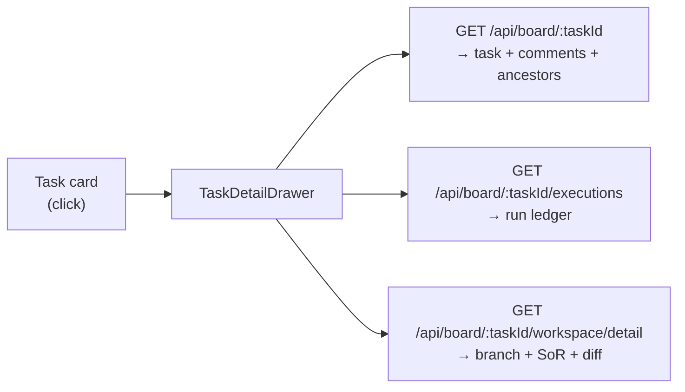
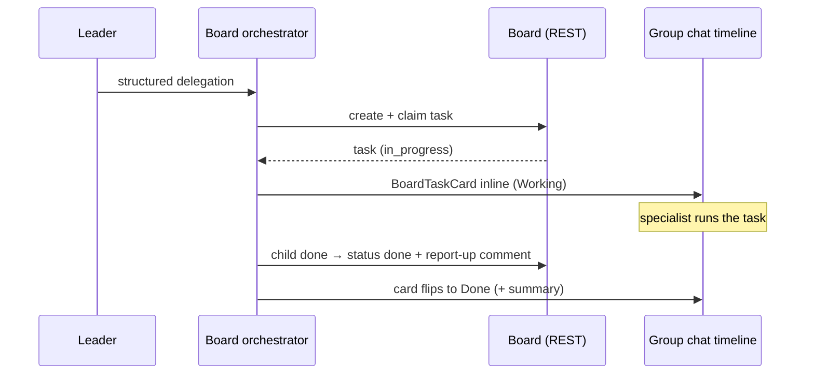

Use this page when you want to see what your team is actually doing; the durable kanban [board](/concepts/the-board) is Clawboo's transactional record of every task, who owns it, whether it verified, and what it cost. The board is canonical; the group chat is narration of it. This page covers the **Board** panel (its columns and cards), the per-task **detail drawer**, and the **chat-fused board** that interleaves task cards directly into group chat.

The Board panel lives in the `BoardPanel` React module and reads `GET /api/board`; the detail drawer (`TaskDetailDrawer`) reads `GET /api/board/:taskId`, `GET /api/board/:taskId/executions`, and `GET /api/board/:taskId/workspace/detail`. For the underlying model, the state machine, the atomic claim, and dependency chains, see [The board](/concepts/the-board). For the full request/response shapes, see the [Board API reference](/reference/rest-api/board).

## Prerequisites

<Note>
The Board panel is always available. Its subsystem is always on, so the panel renders real content with no feature gate; an empty board is just a board with no tasks yet.
</Note>

- A running Clawboo dashboard (`npx clawboo`).
- Tasks on the board. Tasks appear when a team delegates work in group chat, when an agent claims work, or when you create one directly via `POST /api/board`. A fresh install with no team activity shows empty columns.

## Open the board

Click **Board** (the kanban-square icon) in the secondary nav of the left sidebar. The panel mounts in the main content area.

<Note>
The board has no `Cmd/Ctrl`+number shortcut; those are reserved for the six primary views (Atlas, Marketplace, Approvals, Scheduler, Tokens Used, System). Reach the board from the sidebar nav.
</Note>

## The columns

The board renders **seven columns**, one per task status, in lifecycle order:

| Column      | Status        | What it means                                    |
| ----------- | ------------- | ------------------------------------------------ |
| Backlog     | `backlog`     | Triaged, not yet ready to work                   |
| To do       | `todo`        | Ready and claimable                              |
| In progress | `in_progress` | Actively owned by an assignee                    |
| In review   | `in_review`   | Work landed, awaiting the verification gate      |
| Blocked     | `blocked`     | Stalled (e.g. a failed blocker or red-gate debt) |
| Done        | `done`        | Terminal, completed                              |
| Cancelled   | `cancelled`   | Terminal, abandoned                              |

Each column shows its label and a live count of the tasks in it. The panel header shows a total task count (`{N} tasks`) and polls `GET /api/board` every five seconds, so status changes and new tasks appear without a manual refresh. A **Refresh** button forces an immediate re-fetch.

A task whose status falls outside the canonical seven is not silently dropped; an **Other** column is appended only when such a task exists, so off-list statuses stay visible and counted.

<Note>
Until the first fetch resolves, the board shows skeleton columns. If that first fetch fails, the board shows a "Couldn't load the board" error with a **Retry** link (distinct from a genuinely empty board). A *transient* poll failure after a good load keeps the last good snapshot rather than blanking an actively-watched board.
</Note>

## Task cards

Each task is a card showing its title plus a row of badges:

- **Runtime badge**: the task's `assigneeRuntime` (the [runtime](/appendices/glossary) that owns the work), defaulting to `openclaw` when unset.
- **Verification badge**: present only once a [verification](/concepts/verification) verdict is stored. The card parses the task's `verification` JSON and renders the verdict: `pass` (green), `fail` (red), or `debt` for `completed_with_debt` (amber).
- **Cost**: the task's `costUsd`, formatted to three decimals (e.g. `$0.012`), shown only when a cost is recorded.
- **Sub badge**: a "sub" marker when the task has a `parentTaskId` (it was spawned by a delegation).

Click any card to open its detail drawer.

## The task-detail drawer

Clicking a card slides in a right-hand drawer (`TaskDetailDrawer`) for that task. It loads three reads in parallel: the task itself, its execution ledger, and its workspace detail, and presents them as sections. Press `Escape` or click the scrim to close.



The drawer sections, top to bottom:

### Overview

The task's core fields: **Status**, **Assignee** (`assigneeAgentId`), **Runtime** (`assigneeRuntime`, default `openclaw`), **Cost** (`costUsd` to four decimals), and **Parent** (a truncated `parentTaskId`, shown only for subtasks).

### Verification

The stored [verification verdict](/concepts/verification), if any. When present, it shows the verdict pill (`pass` / `fail` / `completed_with_debt`), the reviewer that produced it (runtime and model, surfaced so you can judge a same-model review's independence caveat), any debt notes, and any critic findings (severity + title). When the task has no verdict it reads "No verification verdict yet"; _unverified_ is not _failing_; an un-run gate does not block a task.

### Workspace

The per-task git [worktree](/concepts/worktrees-and-handoff) detail, read from `GET /api/board/:taskId/workspace/detail`:

- **Branch** (`clawboo/task-<id>`) and the absolute **Worktree** path.
- A **Diff** summary (`N files, +insertions −deletions`).
- **System-of-record files**: `TASK.md`, `task-progress.md`, `DECISIONS.json`, `init.sh`, `VERIFICATION.md`, `AGENT_HANDOFF.json` (only those present), each as a collapsible disclosure showing its contents.
- The **unified diff** against the branch-point baseline (the SoR bookkeeping files are excluded from it).

A task with no worktree (research/review tasks, or work not yet provisioned) reads "No worktree provisioned for this task."

### Execution ledger

Every spawned run for the task (`GET /api/board/:taskId/executions`), oldest first. Each row shows the executor (`executorType`), the run's status, its cost, and its token counts (`input↓ output↑`). When a run carries an `error`, that failure reason is shown inline beneath the row; this is where a silently-failed delegate surfaces its reason.

### Activity

A live terminal (`ActivityTerminal`) scoped to this task, the streaming tool-call / tool-result / error feed for the task's runs. It tails the observability event log, so you can watch a run progress in real time. See [Observability](/concepts/observability).

### Comments

The task's comments (discussion and system notes), each prefixed by its `authorType`. The agent report-up summary that a child writes when it finishes a delegation lands here as a comment.

### Lineage / deps

The task's ancestor chain (the parent-task lineage from the recursive-CTE `ancestors` read), rendered as a chain of short ids (`a1b2c3d4 → …`). A top-level task reads "Top-level task (no ancestors)."

## The chat-fused board

In group chat the board is not a separate tab; task cards are interleaved directly into the conversation timeline. When the leader delegates, that delegation becomes a board task, and a `BoardTaskCard` appears inline at the moment the task was created.



How it works:

- **Projection store.** `GroupChatPanel` renders cards from a read-only board projection store (`useBoardStore`), _not_ from the chat transcript. On opening a team it loads the authoritative snapshot via `boardClient.listTasks(teamId)` (a `GET /api/board?teamId=…` read), so the cards survive a page refresh. The orchestrator's client-derived change-feed then applies live mutations (`applyChange`) to the same store, merged last-write-wins by `updatedAt`.
- **Interleaving by `createdAt`.** Each non-`cancelled` board task is placed into the timeline at its `createdAt` timestamp, alongside the chat blocks and any live streaming cards. So a task card appears in causal position, right where the delegation happened, and is not appended to the bottom.
- **Live status.** The `BoardTaskCard` shows the task title, a status pill (Queued → Working → Review → Done / Blocked), and the assignee's avatar + name. As the board change-feed flips the task's status, the card's pill updates in place. A completed (`done`) card also shows the report-up summary; because the summary is a board _comment_ (not a task-row field), a card reloaded after a refresh fetches it lazily from `GET /api/board/:taskId`.

<Info>
The chat-fused board cards and the standalone Board panel read the same canonical board. The panel is the cross-team operator view; the inline cards are the per-team narration. Neither is a write path back to the board; a chat message describes a decision; the [board mutation](/concepts/the-board) *is* the decision.
</Info>

## Verify it worked

- Open **Board**. The header shows `{N} tasks`, and tasks sit in the column matching their status. Click a card and confirm the drawer's **Overview** status matches the card's column.
- In a team's group chat, delegate a piece of work and watch a `BoardTaskCard` appear inline with a **Working** pill, then flip to **Done** with a summary when the run completes.
- Refresh the page; the inline cards reload from `GET /api/board?teamId=…` (refresh-survival), and the panel re-polls. Both show the same task state.
- For the raw data, fetch it directly:

```bash
# All tasks for a team
curl 'http://localhost:18790/api/board?teamId=<team-id>'

# One task + its comments + ancestors
curl 'http://localhost:18790/api/board/<task-id>'
```

## Troubleshooting

<Warning>
**A task is stuck in "In progress" forever.** `tasks.updated_at` is not a per-event liveness heartbeat for the in-browser path, so the panel can't tell a long run from a dead one by itself. A live team-chat client runs its own idle watchdog; a "nobody is watching" stale sweep is the server-side backstop (60-minute default TTL). See [the board's reconciliation](/concepts/the-board#orphan-and-stale-reconciliation).
</Warning>

<Warning>
**A task reached "Done" but the verification badge says nothing.** A task with no stored verdict is *unverified*, not *failing*, and lands `done` normally. The verification gate only blocks a known non-promotable verdict. The autonomous worktree-completion path always writes a verdict before `→done`; a manually completed task may carry none. See [Verification](/concepts/verification).
</Warning>

<Danger>
**"Couldn't load the board."** The first `GET /api/board` failed (server not up, or a transient error). Use the **Retry** link. If it persists, confirm the dashboard is running and reachable on its API port (default `18790`).
</Danger>

## Related

- [The board](/concepts/the-board), the state machine, atomic claim, dependency chains, and reconciliation
- [Board API](/reference/rest-api/board), full request/response shapes for every board route
- [Verification](/concepts/verification), builder≠judge, the deterministic gate + critic, `completed_with_debt`
- [Worktrees and handoff](/concepts/worktrees-and-handoff), the per-task system-of-record behind the Workspace tab
- [Delegation and orchestration](/concepts/delegation-and-orchestration), how delegations become board tasks
- [Group chat](/using/group-chat), where the chat-fused board cards appear
- [Observability](/concepts/observability), the event log behind the Activity terminal
