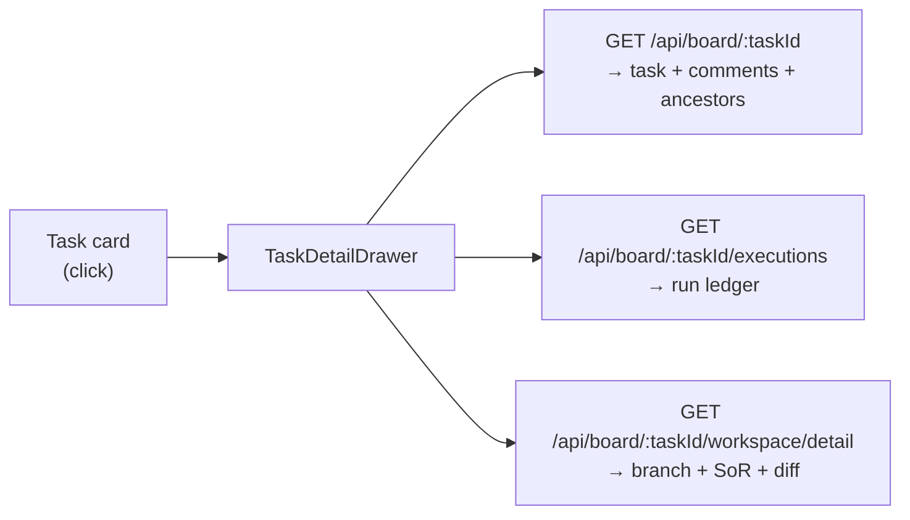
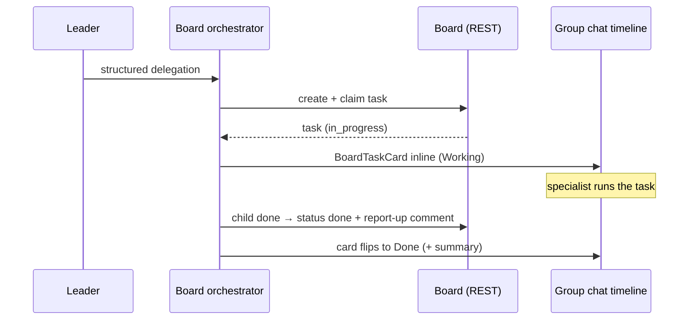

Use this page when you want to see what your team is actually doing; the durable kanban [board](/concepts/the-board) is Clawboo's transactional record of every task, who owns it, whether it verified, and what it cost. The board is canonical; the group chat is narration of it. This page covers the **Board** panel (its columns and cards), the per-task **detail drawer**, and the **chat-fused board** that interleaves task cards directly into group chat.

The Board panel lives in the `BoardPanel` React module and reads `GET /api/board`; the detail drawer (`TaskDetailDrawer`) reads `GET /api/board/:taskId`, `GET /api/board/:taskId/executions`, and `GET /api/board/:taskId/workspace/detail`. For the underlying model, the state machine, the atomic claim, and dependency chains, see [The board](/concepts/the-board). For the full request/response shapes, see the [Board API reference](/reference/rest-api/board).


## Prerequisites

<Note>
The Board panel is always available. Its subsystem is always on, so the panel renders real content with no feature gate; an empty board is just a board with no tasks yet.
</Note>

- A running Clawboo dashboard (`clawboo`).
- Tasks on the board. Tasks appear when a team delegates work in group chat, when an agent claims work, or when you give an agent a task yourself with **New task**. A fresh install with no team activity shows empty columns.

## Open the board

Click **Board** (the kanban-square icon) in the primary nav of the left sidebar, or press **`Cmd/Ctrl + 4`**. The panel mounts in the main content area.

<Note>
The number shortcuts cover four of the sidebar surfaces: `Cmd/Ctrl+1` Atlas, `+2` Fleet, `+3` Marketplace, `+4` Board. Connectors and Memory sit in the sidebar without one, and the rest (Routines, Tokens Used, System, and so on) live in the Settings modal (`Cmd/Ctrl+,`).
</Note>

## The columns

The board renders a **Needs you** column first, then five status columns in lifecycle order:

| Column      | Holds                                                                    |
| ----------- | ------------------------------------------------------------------------ |
| Needs you   | Pending approvals, and every task that will not move until a person acts |
| Backlog     | `backlog` tasks: triaged, not yet ready to work                          |
| To do       | `todo` tasks that will run on their own: queued for their agent          |
| In progress | `in_progress` tasks, plus `in_review` ones (badged **Verifying**)        |
| Done        | `done` tasks                                                             |
| Cancelled   | `cancelled` tasks                                                        |

There is no **In review** column and no **Blocked** column. `in_review` is the automated [verification](/concepts/verification) step: the builder's work is being checked by the deterministic gate and the critic, and nobody is waiting on you, so those cards stay in **In progress** under a **Verifying** badge. When a verdict does need a person, the task moves to `blocked`, and every `blocked` task needs a person, so it lives in **Needs you**. See [Things that need you](#things-that-need-you).

Each column shows its label and a live count of the tasks in it. The panel header shows a total task count (`{N} tasks`) and polls `GET /api/board` every five seconds, so status changes and new tasks appear without a manual refresh. A **Refresh** button forces an immediate re-fetch.

Those reads overlap on purpose (the poll, the Refresh button, and the reconcile that follows a manual create all share one path), so they are **sequenced**: a response may only update the board while it is still the newest read and no local change has been committed since it was issued. A read that resolves out of order is discarded and the next poll reconciles instead, so a card you just created or dragged is never briefly reverted by a request that was already in flight.

Because the board is a live projection of agent activity (agents create and move cards as they work), a one-line hint under the header (_"AI agents continuously create and move work. You can also hand a task to an agent yourself."_) sets that expectation up front. The manual path is real, though: a **New task** button in the header gives one agent a task, each task's status is editable from its [detail drawer](#the-task-detail-drawer), you can **drag a card between columns** (see below), and every card in **Needs you** carries the action that gets it moving again.

A task whose status falls outside the canonical ones is not silently dropped; an **Other** column is appended only when such a task exists, so off-list statuses stay visible and counted.

<Note>
Until the first fetch resolves, the board shows skeleton columns. If that first fetch fails, the board shows a "Couldn't load the board" error with a **Retry** link (distinct from a genuinely empty board). A *transient* poll failure after a good load keeps the last good snapshot rather than blanking an actively-watched board.
</Note>

A genuinely empty board (loaded fine, zero tasks) shows one **"No tasks yet"** empty state instead of a row of identical empty columns. It explains that agents populate the board as work is delegated, and offers a **New task** button to give an agent the first one yourself. **Needs you** still shows beside it, because approvals do not depend on the task list.

## Giving an agent a task

The header's **New task** button hands one agent a task, the human counterpart to Boo Zero delegating. It asks, in order:

1. **Team**, prefilled from the active team filter (or the only team, when there is one).
2. **Agent**, a member of that team. A team with one agent picks it for you; otherwise you choose.
3. **Task**, a short title, and optional **Details**: context, constraints, what done looks like.

**Send to _agent_** writes it through `POST /api/board` with an `assigneeAgentId`. The server binds the task to that agent and starts it right away, so the card appears in **To do** and moves to **In progress** as soon as the agent picks it up. If the agent is busy with another task or still replying in chat, the task waits in **To do** and runs the moment the agent is free. The agent receives the title and the details together.

Only that agent works on it. The task is not routed through Boo Zero, and when it finishes, its result is recorded on the task card (on the board and in the team's group chat) rather than handed to the team lead to act on. If the run fails, the card moves to **Needs you** with the reason. On success a toast confirms who got it; a poll that was already in flight when the task was created is discarded rather than blanking the new card. A failed write keeps the dialog open and toasts the error.

## Things that need you

**Needs you** is always the first column and always expanded, even when it is empty ("Nothing needs you right now"). It is scoped to the team filter and holds two kinds of item:

- **Approval pending.** An agent wants to run a command, call a risky tool, or make a risky delegation. Each request renders as its approval card with **Allow once / Always / Deny**. These come from their own poll rather than `GET /api/board`, so a board outage never hides a time-sensitive gate. See [Approvals](/using/approvals).
- **Tasks nothing will move by themselves.** Each carries a badge naming why, the agent it belongs to, and the reason when the run recorded one:

| Badge        | What happened                                                                   | What you can do      |
| ------------ | ------------------------------------------------------------------------------- | -------------------- |
| Failed       | The last run ended in an error (a crash, a provider error, a killed run)        | Retry, open, dismiss |
| Timed out    | The agent stopped responding and the run was ended                              | Retry, open, dismiss |
| Failed 3×    | The task failed three times in a row, so Clawboo stopped retrying it on its own | Retry, open, dismiss |
| Stopped      | You pressed Stop on its run; it will not restart on its own                     | Retry, open, dismiss |
| Needs review | Verification could not pass it                                                  | Retry, open, dismiss |
| Blocked      | An agent marked it blocked                                                      | Retry, open, dismiss |
| Unassigned   | No agent is bound to it, so nobody will ever pick it up                         | Assign to an agent   |

**Retry** puts the task back in **To do** and sends it straight to its agent, even one Clawboo had stopped retrying automatically: the automatic limit exists to stop the machine looping, not to overrule you. **Assign** gives the task to a member of its team and starts it. **Dismiss** asks first, then moves the task to **Cancelled**. Each action also writes a note on the task's comments (for example "Retry requested."), so the trail shows who did what.

A stuck task does not hold anything else up. Its agent is free for other work, the tasks that depended on a failed one are cancelled so they do not wait forever, and a team lead waiting on results is told about the failure instead of being kept waiting. Why a task is stuck is computed by the server from the task's run history and returned as its `attention` field; see the [Board API](/reference/rest-api/board).

## Moving a task by drag-and-drop

Each card has a **grip handle** (top-right, visible on hover or keyboard focus). Dragging a card to another column is a status change: it writes through the same `PATCH /api/board/:taskId` path as the drawer's status editor, so the server stays authoritative and the same rules apply.

- **Only legal moves are offered.** Mid-drag, columns the card can't legally transition to (per the [state machine](/concepts/the-board)) are dimmed and won't accept a drop; terminal cards (`done` / `cancelled`) and off-list **Other** cards aren't draggable at all. Cards in **Needs you** are moved with their own buttons (Retry, Assign, Dismiss) instead of by dragging.
- **The agent-release guard still applies.** Dragging an _assigned_ task to **To do** — which unassigns its agent — asks for confirmation first, exactly as the drawer editor does.
- **Optimistic + poll-safe.** The card moves instantly and is reconciled against the server; a rejected move (e.g. a `→ done` verification gate) rolls back with a toast. Neither an in-flight move nor a just-committed one is reverted by the five-second poll, including a poll already in flight when the move landed.
- **Keyboard and touch.** Focus a card's handle and press **Space** to pick it up, **arrow keys** to choose a column, **Space** to drop, **Escape** to cancel; touch drag is supported too.

Clicking a card (rather than its handle) still opens the detail drawer — a click and a drag don't conflict.

## Task cards

Each task is a card showing its title plus a row of badges:

- **Verifying**: shown on an `in_review` task while its verification runs.
- **Runtime badge**: the task's `assigneeRuntime` (the [runtime](/appendices/glossary) that owns the work), defaulting to `openclaw` when unset.
- **Verification badge**: present only once a [verification](/concepts/verification) verdict is stored. The card parses the task's `verification` JSON and renders the verdict: `pass` (green), `fail` (red), or `debt` for `completed_with_debt` (amber).
- **Cost**: the task's `costUsd`, shown only when a cost is recorded. An exactly-zero cost reads `$0.000`; a sub-cent cost keeps four decimals (`$0.0004`) so a real charge is never rounded away; a cost of one cent or more shows cents (`$0.42`).
- **Sub badge**: a "sub" marker when the task has a `parentTaskId` (it was spawned by a delegation).

Click any card to open its detail drawer.

## The task-detail drawer

Clicking a card slides in a right-hand drawer (`TaskDetailDrawer`) for that task. It loads three reads in parallel: the task itself, its execution ledger, and its workspace detail, and presents them as sections. Press `Escape` or click the scrim to close.



```mermaid
flowchart LR
  card["Task card<br/>(click)"] --> drawer["TaskDetailDrawer"]
  drawer --> a["GET /api/board/:taskId<br/>→ task + comments + ancestors"]
  drawer --> b["GET /api/board/:taskId/executions<br/>→ run ledger"]
  drawer --> c["GET /api/board/:taskId/workspace/detail<br/>→ branch + SoR + diff"]
```

The drawer sections, top to bottom:

### Needs you

Shown only for a task in the **Needs you** column: its badge, the reason in full, and the same **Retry**, **Assign** and **Dismiss** actions.

### Brief

The task's description, when it says more than the title: for a task you gave an agent, the details you wrote.

### Overview

The task's core fields: **Status**, **Agent** (by name: the one working it, or the one it is bound to while it waits), **Team**, **Runtime** (`assigneeRuntime`, default `openclaw`), **Cost** (`costUsd` to four decimals), and **Parent** (a truncated `parentTaskId`, shown only for subtasks).

**Status** is an inline editor, not just a label: a dropdown that offers only the transitions the [state machine](/concepts/the-board) permits from the current status (minus **In review**, the automated verification step, which is never a manual choice) (so it never lets you pick a move the server would reject), writes through `PATCH /api/board/:taskId`, and updates optimistically, rolling back and toasting if the write is refused, with the message naming the cause (an illegal transition vs. the verification gate). A committed change also moves the card to its new column on the board immediately rather than waiting for the five-second poll; it goes through the same shared commit path as [drag-and-drop](#moving-a-task-by-drag-and-drop), so a read already in flight can't snap the card back. Releasing a task to **To do** additionally clears its assignee, runtime, and stored verdict, so the card's verification badge disappears and its runtime badge falls back to `openclaw`, matching what the server writes. Terminal tasks (`done` / `cancelled`) have no legal moves, so the control locks.

When a `→ done` is refused **specifically by the [verification](/concepts/verification) gate** (the task carries a non-promotable verdict), the editor doesn't dead-end: it offers a **"Complete anyway"** confirmation that re-submits with the server's `humanOverride`. That's the supported path for a human shipping despite a non-promotable verdict — and, like on the server, the override is **recorded in the audit log**. An _illegal_ transition can't be overridden this way (the override only bypasses the verification gate, not the state machine). This lives in the shared status-mutation path, so it works the same whether you change status from this drawer or by [dragging a card](#moving-a-task-by-drag-and-drop) to the Done column.

### Verification

The stored [verification verdict](/concepts/verification), if any. When present, it shows the verdict pill (`pass` / `fail` / `completed_with_debt`), the reviewer that produced it (runtime and model, surfaced so you can judge a same-model review's independence caveat), any debt notes, and any critic findings (severity + title). When the task has no verdict it reads "No verification verdict yet"; _unverified_ is not _failing_; an un-run gate does not block a task.

### Workspace

The per-task git [worktree](/concepts/worktrees-and-handoff) detail, read from `GET /api/board/:taskId/workspace/detail`:

- **Branch** (`clawboo/task-<id>`) and the absolute **Worktree** path.
- A **Diff** summary (`N files, +insertions −deletions`).
- **System-of-record files**: `TASK.md`, `task-progress.md`, `DECISIONS.json`, `init.sh`, `VERIFICATION.md`, `AGENT_HANDOFF.json` (only those present), each as a collapsible disclosure showing its contents.
- The **unified diff** against the branch-point baseline (the SoR bookkeeping files are excluded from it).

A task with no worktree (research/review tasks, or work not yet provisioned) reads "No worktree provisioned for this task."

### Execution ledger

Every spawned run for the task (`GET /api/board/:taskId/executions`), oldest first. Each row shows the executor (`executorType`), the run's status, its cost, and its token counts (`input↓ output↑`). When a run carries an `error`, that failure reason is shown inline beneath the row; this is where a silently-failed delegate surfaces its reason.

### Activity

A live terminal (`ActivityTerminal`) scoped to this task, the streaming tool-call / tool-result / error feed for the task's runs. It tails the observability event log, so you can watch a run progress in real time. See [Observability](/concepts/observability).

### Comments

The task's comment log, oldest first, each entry attributed the way you would say it: the agent by name, **You** for your own actions (a retry, an assignment), and **Clawboo** for the notes the orchestrator writes itself (a run failing, a result arriving late, a limit being hit). The agent's report when it finishes lands here too.

### Lineage / deps

The task's ancestor chain (the parent-task lineage from the recursive-CTE `ancestors` read), rendered as a chain of short ids (`a1b2c3d4 → …`). A top-level task reads "Top-level task (no ancestors)."

## The chat-fused board

In group chat the board is not a separate tab; task cards are interleaved directly into the conversation timeline. When the leader delegates, that delegation becomes a board task, and a `BoardTaskCard` appears inline at the moment the task was created.


```mermaid
sequenceDiagram
  participant L as Leader
  participant O as Board orchestrator
  participant B as Board (REST)
  participant C as Group chat timeline
  L->>O: structured delegation
  O->>B: create + claim task
  B-->>O: task (in_progress)
  O->>C: BoardTaskCard inline (Working)
  Note over C: specialist runs the task
  O->>B: child done → status done + report-up comment
  O->>C: card flips to Done (+ summary)
```

How it works:

- **Projection store.** `GroupChatPanel` renders cards from a read-only board projection store (`useBoardStore`), _not_ from the chat transcript. On opening a team it loads the authoritative snapshot via `boardClient.listTasks(teamId)` (a `GET /api/board?teamId=…` read), so the cards survive a page refresh. The orchestrator's client-derived change-feed then applies live mutations (`applyChange`) to the same store, merged last-write-wins by `updatedAt`.
- **Interleaving by `createdAt`.** Each non-`cancelled` board task is placed into the timeline at its `createdAt` timestamp, alongside the chat blocks and any live streaming cards. So a task card appears in causal position, right where the delegation happened, and is not appended to the bottom.
- **Live status.** The `BoardTaskCard` shows the task title, a status pill (Queued, Working, Verifying, Done, Cancelled), and the assignee's avatar + name. A task that needs you says why instead (**Failed**, **Timed out**, **Stopped**, **Unassigned**), with a **Resolve on board** link. As the board change-feed flips the task's status, the card's pill updates in place. A completed (`done`) card also shows the report-up summary, and a failed one shows the reason; because both are board _comments_ (not task-row fields), a card reloaded after a refresh fetches them lazily from `GET /api/board/:taskId`.
- **The trail.** **Comments & activity** at the foot of each card opens, inside the card, the task's comment log and its live activity feed (tool calls, results, errors). It is folded away by default so the timeline stays readable; open it to see how a task reached its result or why it failed.
- **Open on board.** The expand icon beside the status pill switches to the Board, filtered to the team, with that task's detail drawer open.

<Info>
The chat-fused board cards and the standalone Board panel read the same canonical board. The panel is the cross-team operator view; the inline cards are the per-team narration. Neither is a write path back to the board; a chat message describes a decision; the [board mutation](/concepts/the-board) *is* the decision.
</Info>

## Verify it worked

- Open **Board**. The header shows `{N} tasks`, and tasks sit in the column matching their status (a failed or stopped task sits in **Needs you**). Click a card and confirm the drawer's **Overview** status matches the card's column.
- Click **New task**, pick a team and an agent, and send it. The card appears in **To do**, moves to **In progress** when the agent starts, and shows up in that team's group chat.
- In a team's group chat, delegate a piece of work and watch a `BoardTaskCard` appear inline with a **Working** pill, then flip to **Done** with a summary when the run completes.
- Refresh the page; the inline cards reload from `GET /api/board?teamId=…` (refresh-survival), and the panel re-polls. Both show the same task state.
- For the raw data, fetch it directly:

```bash
# All tasks for a team
curl 'http://localhost:18790/api/board?teamId=<team-id>'

# One task + its comments + ancestors
curl 'http://localhost:18790/api/board/<task-id>'
```

## Troubleshooting

<Warning>
**A task is stuck in "In progress" forever.** `tasks.updated_at` **is** a liveness heartbeat: the drain that owns the task beats the row every 30 s on a timer, so a stale sweep releases it after `CLAWBOO_BOARD_STALE_TTL_MS` (default 3 minutes, six missed beats) once the owner is gone. The server orchestrator's own 8-minute idle watchdog covers the other case, a delegate that is alive but has gone silent (and it keeps running with the browser closed). See [the board's reconciliation](/concepts/the-board#orphan-and-stale-reconciliation).
</Warning>

<Warning>
**A task reached "Done" but the verification badge says nothing.** A task with no stored verdict is *unverified*, not *failing*, and lands `done` normally. The verification gate only blocks a known non-promotable verdict. The autonomous worktree-completion path always writes a verdict before `→done`; a manually completed task may carry none. See [Verification](/concepts/verification).
</Warning>

<Danger>
**"Couldn't load the board."** The first `GET /api/board` failed (server not up, or a transient error). Use the **Retry** link. If it persists, confirm the dashboard is running and reachable on its API port (default `18790`).
</Danger>

## Related

- [The board](/concepts/the-board), the state machine, atomic claim, dependency chains, and reconciliation
- [Board API](/reference/rest-api/board), full request/response shapes for every board route
- [Verification](/concepts/verification), builder≠judge, the deterministic gate + critic, `completed_with_debt`
- [Worktrees and handoff](/concepts/worktrees-and-handoff), the per-task system-of-record behind the Workspace tab
- [Delegation and orchestration](/concepts/delegation-and-orchestration), how delegations become board tasks
- [Group chat](/using/group-chat), where the chat-fused board cards appear
- [Observability](/concepts/observability), the event log behind the Activity terminal
