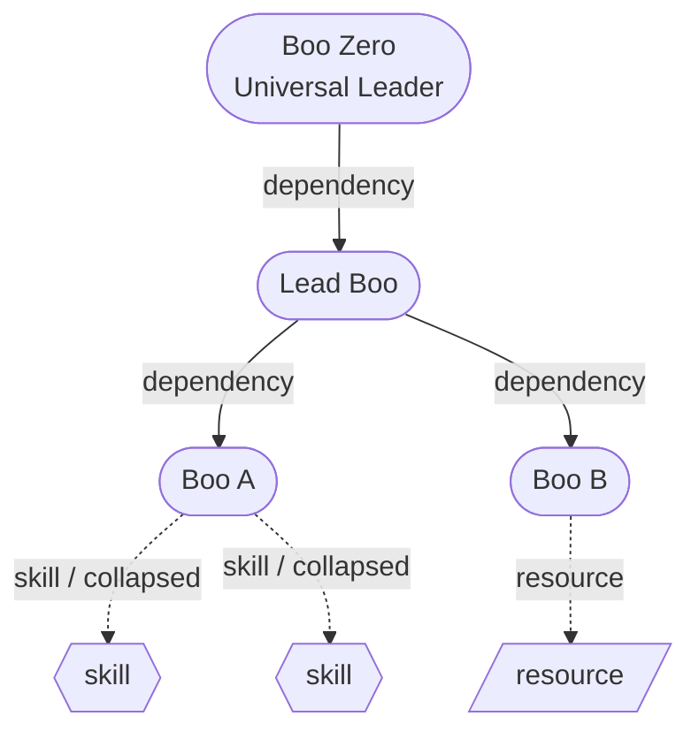

Use this page when you want to _see_ how your agents relate: who reports to whom, which skills each Boo carries, and what each one is doing right now. Clawboo renders this as a React Flow canvas in two scopes: **Atlas** (the global all-teams org graph) and the per-team **Ghost Graph** (embedded inside a team's group chat). Both are the same `GhostGraph` component driven by a `scope` prop; what differs is which agents they show and a couple of Atlas-only controls.

Every node and edge maps to real state: a [Boo](/appendices/glossary) is a real agent record, a dependency edge is a routing rule in that agent's `AGENTS.md`, and a skill orbital is a capability from the unified inventory. Nothing on the canvas is decorative.

## Prerequisites

<Note>
The graph reads your fleet from the agent registry and the capability inventory; it does not need a live Gateway connection to *render* (positions and structure come from SQLite). But **connect mode** (drawing routing edges) writes to an agent's `AGENTS.md` through the runtime, so it needs a connected client.
</Note>

- A team with at least one agent (Boo) to see anything. An empty fleet shows the "No agents yet" empty state.
- For drawing or removing routing edges, an active connection (`useConnectionStore.client` non-null).

## Atlas vs the per-team Ghost Graph

| Aspect                            | **Atlas** (`scope = 'atlas'`)                                                                                           | **Per-team Ghost Graph** (`scope = 'team'`)                                                  |
| --------------------------------- | ----------------------------------------------------------------------------------------------------------------------- | -------------------------------------------------------------------------------------------- |
| Where it lives                    | The **Atlas (All Teams)** nav button (Globe icon, top of the primary nav). The nav view id is `graph`.                  | The top pane of a team's **group chat** (`TeamSpaceSplit`), rendered `embedded`.             |
| Which agents                      | Every agent across every team. Ignores the sidebar's selected team.                                                     | Only agents whose `teamId` matches the sidebar's `selectedTeamId`.                           |
| Boo Zero                          | Synthesized at the top of the org chart with a **Universal Leader** signal; edges fan out to each team's internal lead. | Synthesized into the team's graph as the team's apex.                                        |
| Team halos toggle                 | Visible (Atlas-only).                                                                                                   | Hidden, and halos are forced off regardless of the sticky toggle value.                      |
| Atlas layout pill (Tree / Radial) | Visible.                                                                                                                | Not applicable.                                                                              |
| Activity dock                     | A right-edge slide-in "all teams" live activity terminal.                                                               | Not present (group chat already narrates the team).                                          |
| Toolbar chrome                    | Shown: Atlas is the view's only identity.                                                                               | The panel toolbar is suppressed (`embedded`); the team chat header owns identity and counts. |

The selected team in the sidebar is **preserved** when you enter Atlas, so the two graphs keep independent saved layouts (Atlas positions are global and split by layout mode; team positions are keyed `team-<id>`). Switching scopes never overwrites the other's positions.

## The canvas

- **Boo nodes** (red dots / cards) are your agents. The leader-rooted spanning tree from `AGENTS.md` routing rules drives the org-chart hierarchy: ELK lays out Boos and the primary dependency edges; secondary routes are revealed only on hover.
- **Dependency edges** (red, with arrowheads) are agent-to-agent routing: "this agent routes work to the target." Each one is a line in the source agent's `AGENTS.md`.
- **Skill nodes** (mint circles) and **resource nodes** (amber cards) are each Boo's capabilities, drawn as orbitals around their parent. They are hidden by default and revealed by [expanding a Boo](#expand-a-boos-skills-peacock). An agent that has no per-agent capabilities of its own (Codex, OpenClaw, a not-yet-run Hermes agent) shows its runtime's shared capabilities instead, so every agent surfaces its attached MCP and built-ins.
- **Runtime badge + model orbital.** Every Boo carries a small **runtime brand chip** on its avatar, so you can tell Native, OpenClaw, Claude Code, Codex, and Hermes apart at a glance. Expanding a Boo also pops out a **model orbital**, the provider logo plus the LLM it runs on. Every Boo has one: an account/SDK-default runtime (Codex, Claude Code) shows a neutral "default" chip rather than a specific model, and an OpenClaw agent shows its Gateway default model.

### Dual-shape Boo nodes (idle circle / active card)

A Boo renders in one of two shapes, and morphs between them with a CSS size-and-shape transition:

- **Idle** (`status !== 'running'`): a degree-aware **circle** (bigger if it has more edges), avatar filling the disc, with the name, a status dot, and a "seen Xm ago" timestamp stacked below it. This is the relaxed org-chart reading: agents waiting in a room.
- **Active** (`status === 'running'`): a **card** (280×170) in three bands: a header (avatar + name + status pill), a **live activity feed** in the middle, and a reserved footer. The card morphs in when the agent starts working, so the canvas reads as a live control room when things are happening.

The middle band of the active card is a real-time feed. It shows, in priority order, the agent's **in-flight streaming text**, then its **most recent assistant message**, then its **most recent tool call** (formatted `[[tool: <label>]]`). Thinking, meta, and user lines are skipped; the feed shows what the agent is _doing_, not its reasoning or your prompt. While running with no signal yet, it shows a typing indicator.

<Tip>
Status drives the glow: a running Boo pulses mint, an error Boo glows orange, a sleeping Boo dims. The status dot and label (`idle` / `active` / `error` / `sleeping`) appear under idle circles and in the active card's header pill.
</Tip>

### Hover to focus a cluster

Hovering a node highlights its connected nodes and edges and dims everything else (non-connected nodes fade, non-connected edges nearly vanish). Move off, and full opacity returns. This is the fast way to read a single agent's relationships in a dense graph.

## Steps

### Expand a Boo's skills (peacock)

By default the canvas shows only Boos and dependency edges; skill and resource orbitals are mounted but hidden, keeping the view focused on team topology.

1. **Single-click a Boo.** Its orbital children fan out from behind it with a staggered "peacock-feather" animation (`expandedBooNodeIds` gains the Boo's node id).
2. **Single-click it again** to collapse them.

Multiple Boos can be expanded at once; each toggles independently. The camera re-fits to frame only the Boos plus any currently-expanded orbitals, so expanding doesn't shrink your Boos to make room for invisible rings.

<Note>
The MiniMap matches: collapsed skill/resource dots render transparent there, so at rest the MiniMap shows only the Boo dots; expand a Boo and its mint (skill) / amber (resource) dots appear in sync with the canvas.
</Note>

### Install a skill onto a Boo

Two ways, both routed through the unified capability pipeline (`POST /api/capabilities/install`), which writes an audited record into the managed source and refreshes the graph:

- **From a skill node's "Install →" button**: hover a skill, click **Install →**, then pick a target agent from the dropdown.
- **By drag**: drag a skill node onto a Boo node. (The server resolves the owning runtime authoritatively from the agent row, so the install lands on the right runtime regardless of the placeholder sent.)

A toast confirms `Installed "<skill>" on <agent>`. The leadership orbital that accompanies Boo Zero is non-transferrable; it has no Install button.

### Draw a routing edge (connect mode)

Routing edges are agent-to-agent delegation rules. To add one from the canvas:

1. Click **Connect** in the top-right toolbar. The button reads **Drawing Edges** while active and makes every Boo's connection handles always-visible. (You can also click-to-connect: click a source handle, then a target handle.)
2. Drag from one Boo to another. Clawboo **optimistically** adds the edge, then appends `- Route to @<TargetName> for delegated tasks.` to the source agent's `AGENTS.md` (via the per-agent mutation queue) and best-effort enables agent-to-agent coordination in Gateway config. On failure the optimistic edge rolls back with an error toast.

Dropping a **skill** node onto a Boo in connect mode performs a skill install instead of a routing edge; the canvas validates that source/target pair and routes accordingly.

<Note>
Drawing the same edge twice is a no-op: if the target is already in the source's routing, you get a `<target> already in routing` toast and nothing is written.
</Note>

### Remove a routing edge

1. Click a dependency edge to open the **edge explain panel** (bottom-center). It names the connection, the source agent, and the backing file (`AGENTS.md` for dependencies; the capability inventory for skill/resource edges).
2. Click **Remove Connection**. Clawboo optimistically removes the edge, then strips every `@<TargetName>` mention from the source agent's `AGENTS.md`. On failure the edge is restored.

### Right-click a Boo (context menu)

Right-click any Boo for its action menu:

| Item                  | What it does                                                                |
| --------------------- | --------------------------------------------------------------------------- |
| **Chat**              | Selects the agent and opens its detail view (1:1 chat).                     |
| **Edit personality**  | Opens the agent detail view (personality sliders live there).               |
| **Edit files**        | Opens the agent detail view (SOUL / IDENTITY / TOOLS / AGENTS editor).      |
| **Select in sidebar** | Highlights the agent in the fleet sidebar without leaving the graph.        |
| **Delete**            | Deletes the agent (archives it through the runtime + cleans up local rows). |

The first three all land in the same place, the [agent detail view](/using/agents). `Select in sidebar` is the highlight-only action; left-click is reserved for peacock expand.

### Re-layout

Click **Re-layout** (top-right, appears once the first layout has run) to recompute positions from scratch. It drops your saved drag positions, re-runs ELK for the Boo hierarchy + orbital math for skills, and persists the fresh positions so a refresh is a no-op. Use it after adding agents or routes if the auto-layout looks tangled.

## Atlas-only controls

### Tree vs Radial layout

In Atlas, a segmented pill in the toolbar toggles the global topology:

- **Tree** (`top-down`): Boo Zero at the top, teams in a flat row beneath it (the org-chart sketch).
- **Radial** (default): Boo Zero at the center with teams arranged as petals around it.

Your choice persists in `localStorage` (`clawboo.atlas.layout`). Each mode keeps its own saved drag positions (`atlas-top-down` vs `atlas-radial`), so flipping modes never drags one mode's coordinates into the other.

### Team halos

Click **Team halos** (Atlas-only, Pin icon) to draw a colored convex-hull background behind each team's Boos, a visual grouping for the Skills → Agents → Teams hierarchy. It is a pure overlay: it never touches the node tree, physics, or ELK layout. Single-agent teams render no halo (the Boo's team badge is enough); the toggle is off by default.

### Activity dock

Click **Activity** (Atlas-only, Terminal icon) to slide in a right-edge live-activity terminal scoped to all teams, the "what is every team doing right now" feed, sourced from the orchestration event log. The dock is always mounted (so it animates both ways) but only tails events while open.

## The MiniMap

The MiniMap (bottom-right overview) is **hidden by default** to give Boos more canvas. A small toggle (Map icon) at the bottom-right shows it; while shown the toggle slides left of it and becomes an X. It sizes proportionally to the canvas (~16% wide). Boos render as a representative-sized dot rather than their full transparent footprint, and collapsed skill/resource dots are transparent, so the MiniMap reflects what you actually see.

## Verify it worked

- **Skill install**: after installing, the skill orbital appears on the target Boo (expand it to see it) and a success toast fires. The new capability also shows on the [Capabilities dashboard](/using/capabilities-dashboard).
- **Routing edge added**: a red dependency edge appears between the two Boos; clicking it shows the source agent and `via AGENTS.md` in the explain panel.
- **Routing edge removed**: the edge disappears and the source agent's `AGENTS.md` no longer mentions the target.
- **Layout persists**: drag a Boo, then refresh. It stays where you dropped it (positions are saved to `/api/graph-layout`, keyed per scope/team/mode).

## Troubleshooting

<Warning>
**Boos pile up at the top-left on a new team, or the layout looks broken after switching Atlas modes.** This happens when stale saved positions partially cover the current node set (e.g. Boo Zero is newly synthesized) or carry the other layout mode's coordinates. Click **Re-layout** to force a fresh ELK pass; it drops the stale positions and re-persists clean ones.
</Warning>

<Warning>
**Connect mode does nothing when you drag between Boos.** Drawing a routing edge writes through the connected runtime; if there is no active client, the write is skipped silently. Confirm the connection (a runtime is connected and the fleet is hydrated), then try again.
</Warning>

<Danger>
**Delete from the right-click menu is destructive.** It archives the agent through its runtime and removes its local rows (cost, approvals, per-agent settings). There is no undo from the graph.
</Danger>

## See also

- [Using teams](/using/teams), create teams, set the leader that roots the org chart, color collections
- [Using agents](/using/agents), edit `SOUL` / `IDENTITY` / `TOOLS` / `AGENTS`, personality sliders
- [Using group chat](/using/group-chat), where the per-team Ghost Graph is embedded
- [The board](/concepts/the-board), the durable task board the orchestration runs on
- [Capabilities dashboard](/using/capabilities-dashboard), the full capability inventory that drives skill/resource nodes
- [Observability dashboard](/using/observability-dashboard), the event log behind the Atlas activity dock and live Boo cards
