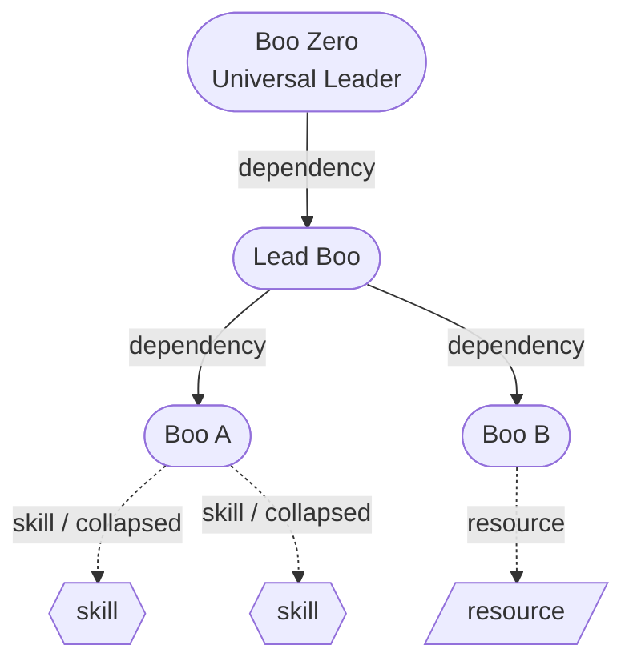

Use this page when you want to _see_ how your agents relate: who reports to whom, which skills each Boo carries, and what each one is doing right now. Clawboo renders this as a React Flow canvas in two scopes: **Atlas** (the global all-teams org graph) and the per-team **Ghost Graph** (embedded inside a team's group chat). Both are the same `GhostGraph` component driven by a `scope` prop; what differs is which agents they show and a couple of Atlas-only controls.

Every node and edge maps to real state: a [Boo](/appendices/glossary) is a real agent record, a dependency edge is a routing rule in that agent's `AGENTS.md`, and a skill orbital is a capability from the unified inventory. Nothing on the canvas is decorative.

## Prerequisites

<Note>
The graph reads your fleet from the agent registry and the capability inventory; it does not need a live Gateway connection to *render* (positions and structure come from SQLite). Drawing a routing edge writes the source agent's `AGENTS.md` through Clawboo's server, which needs no Gateway for a native agent; an OpenClaw agent's file lives on its Gateway, so for that agent the Gateway has to be connected.
</Note>

- A team with at least one agent (Boo) to see anything. An empty fleet shows the "No agents yet" empty state.
- For removing a routing edge, an active connection (`useConnectionStore.client` non-null).

## Atlas vs the per-team Ghost Graph

| Aspect                            | **Atlas** (`scope = 'atlas'`)                                                                                           | **Per-team Ghost Graph** (`scope = 'team'`)                                                  |
| --------------------------------- | ----------------------------------------------------------------------------------------------------------------------- | -------------------------------------------------------------------------------------------- |
| Where it lives                    | The **Atlas (All Teams)** nav button (org-chart icon, top of the primary nav). The nav view id is `graph`.              | The top pane of a team's **group chat** (`TeamSpaceSplit`), rendered `embedded`.             |
| Which agents                      | Every agent across every team. Ignores the sidebar's selected team.                                                     | Only agents whose `teamId` matches the sidebar's `selectedTeamId`.                           |
| Boo Zero                          | Synthesized at the top of the org chart with a **Universal Leader** signal; edges fan out to each team's internal lead. | Synthesized into the team's graph as the team's apex.                                        |
| Team halos toggle                 | Visible (Atlas-only).                                                                                                   | Hidden, and halos are forced off regardless of the sticky toggle value.                      |
| Atlas layout pill (Tree / Radial) | Visible.                                                                                                                | Not applicable.                                                                              |
| Activity dock                     | A right-edge slide-in live activity terminal for every team.                                                            | The same dock, scoped to this team.                                                          |
| Team badge                        | On each team's junction, where its branch meets Boo Zero.                                                               | On the point where Boo Zero's edge splits into the team (or halfway down it, to a lead).     |
| Browser dock                      | A right-edge slide-in view of the page an agent is looking at, with its team's Boos above it to switch between them.    | Present. What an agent is looking at is as much a team question as an Atlas one.             |
| Toolbar chrome                    | Shown: Atlas is the view's only identity.                                                                               | The panel toolbar is suppressed (`embedded`); the team chat header owns identity and counts. |

The selected team in the sidebar is **preserved** when you enter Atlas, so the two graphs keep independent saved layouts (Atlas positions are global and split by layout mode; team positions are keyed `team-<id>`). Switching scopes never overwrites the other's positions.

## Building on the canvas

Hover a Boo and its **port** appears on its right edge: a raised disc with a plus, tucked against its claw, with a **Drag to connect** hint beside it. It stays out of sight otherwise, so a canvas of resting Boos is not covered in plus signs (on a touch screen, which cannot hover, it stays visible). Pull a thread out of the port and let go.

While a thread is out, every Boo it can land on raises a dashed **docking ring**, with a dot on top where the thread will attach. The whole ring is the drop target, not just the dot, and it turns solid as the thread passes over it. The Boo you pulled from shows no ring, because an agent cannot route to itself. The ring takes the thread's colour, so a connector's violet thread docks into violet rings.

| Where you let go | What happens                                 |
| ---------------- | -------------------------------------------- |
| On another Boo   | Routes the first agent to the second         |
| On empty canvas  | Opens a picker of what the thread can end in |

To give an agent a skill or connector another agent already has, drag that tile onto the agent instead: a skill installs (see [Install a skill onto a Boo](#install-a-skill-onto-a-boo)), and a connector opens the dialog that shares it (see [Connectors](/using/connectors)).

The port is on every graph that draws a Boo: Atlas, a team's graph, and the mini graph in an agent's view. The mini graph draws one agent, so there it offers skills and connectors but not a new agent.

The port and the rings keep a minimum size on screen, so they stay usable when the canvas is zoomed far out. Locking the canvas (the padlock at the bottom right) hides the port and stops drops, along with dragging.

A thread only raises the ports of the Boo it came from: hovering another Boo on the way to a target shows its docking ring, not its port.

The picker asks what kind of thing you want first: **Connectors**, **Skills**, or **New agent**. Pick one and it shows that list, ordered so the entries you can finish in a single click come first. The back arrow, Escape, or backspacing to an empty box all return to the choice.

If you already know the name, just type. Searching from the first screen looks across every kind at once and skips the second step, and the last row offers to create an agent named after whatever you typed. A new Boo lands in the same team as the one you pulled from, already routed to it.

A connector that needs a key or a folder is listed but greyed, with the reason. Those are set up in [Connectors](/using/connectors), because a credential is a form and not a canvas gesture.

### The + button

Every graph leads its toolbar with a **+** button, tooltip **Add a connector, skill or agent** (in an agent's mini graph, **Add a connector or skill**). It opens the same picker, with no agent behind it, so what you pick lands on the canvas attached to nothing:

| You pick    | What lands on the canvas                                                                                                                                                               |
| ----------- | -------------------------------------------------------------------------------------------------------------------------------------------------------------------------------------- |
| A skill     | A loose skill tile                                                                                                                                                                     |
| A connector | The connector is turned on first if it is not running (a sign-in where it has one), then a loose connector tile                                                                        |
| New agent   | A new Boo with no routes yet. In a team's graph it joins that team; in Atlas it joins the team selected in the sidebar, and the picker says which. The mini graph offers no new agent. |

A loose tile drops in just under the **+** button, clear of the graph, with a dashed ring and **Not attached** under its name. Hover it for its port and a **Drag onto an agent** hint, then drag the thread onto any Boo: that agent gets the skill, or the connector at write access with risky calls still asking first. The tile then leaves the canvas, because the thing now orbits that agent like any other capability. If the agent already has it, a toast says so and nothing is written; let go anywhere else and the tile stays put.

Hover a loose tile for an **x** that takes it back off the canvas. Each graph keeps its own loose tiles (Atlas, each team's graph, each agent's mini graph), they come back after a reload, and the picker never offers a second copy of one already there. A loose tile keeps a readable size when the canvas is zoomed far out, and when a layout change or a smaller window would leave one out of view, it moves back under the **+** button.

Each Boo shows what it carries under its name: `12 capabilities · 1 route`. Hover the count to see what kinds they are, for example `1 skill, 2 tools, 3 connectors, 6 plugins, built-in tools; 1 route`. It counts everything the agent has, including what its ring folds into a group or Atlas cuts, so it is the same number in every view. Clicking the Boo opens the ring, and the count steps aside while the ring is open.

The count beside a graph's title (`3 Boos · 1 skill`) counts skills only: the ones a person installed, never tools, plugins or the built-in tool set.

### Taking something back

Click an edge to open its panel, then **Remove Connection**. Or select an edge and press Backspace or Delete, which works anywhere except while you are typing in a field. Routes, skills and shares all come off the same way, and a share carries an eight-second Undo.

Backspace removes the selected **edge** only. It never deletes an agent: that stays on the right-click menu, which asks the server rather than only removing the node from your screen.

Some edges refuse, and say why: a runtime built-in came with the agent, and the model tile is part of the Boo rather than something added to it.

### What is not here

Creating a team, adding a custom MCP server, entering a credential, choosing a folder, and editing a personality are not on the canvas. Each needs more than a name or a pick, and a canvas button that opens another window is worse than no button. They live in the Marketplace, Connectors, and the agent's own view.

An agent's runtime cannot be changed after it is created, anywhere.

## The canvas

```mermaid
flowchart TD
  BZ([Boo Zero<br/>Universal Leader])
  L1([Lead Boo])
  A([Boo A])
  B([Boo B])
  S1{{skill}}
  S2{{skill}}
  R1[/resource/]

  BZ -->|dependency| L1
  L1 -->|dependency| A
  L1 -->|dependency| B
  A -.->|skill / collapsed| S1
  A -.->|skill / collapsed| S2
  B -.->|resource| R1
```

- **Boo nodes** (red dots) are your agents. The leader-rooted spanning tree from `AGENTS.md` routing rules drives the org-chart hierarchy: ELK lays out Boos and the primary dependency edges; secondary routes are revealed only on hover.
- **Dependency edges** (red, with arrowheads) are agent-to-agent routing: "this agent routes work to the target." Each one is a line in the source agent's `AGENTS.md`, and the `N routes` count under a Boo's name counts exactly those: the routes a person authored, never the invisible backbone Atlas adds to lay teams out.
- **Skill nodes** (mint circles) and **connector nodes** (violet circles) are each Boo's capabilities, drawn as orbitals around their parent. An OpenClaw plugin is violet too, with a puzzle piece, or with the provider's own logo when the plugin is a model provider such as Anthropic or OpenAI. A tile shows a readable name (`Web Search`, `Device Pair`) and keeps the exact key the runtime reports in its tooltip. They are hidden by default and revealed by [expanding a Boo](#expand-a-boos-skills-peacock). A Boo draws its own per-agent capabilities AND its runtime's shared ones together, so an agent that has picked up a skill of its own keeps the built-ins it already had. An agent with none of its own (Codex, OpenClaw, a not-yet-run Hermes agent) therefore shows exactly its runtime's shared capabilities, so every agent surfaces its attached MCP and built-ins.
- **Grant edges** connect a Boo to a [connector](/using/connectors) somebody deliberately shared with it. Drag a connector tile onto a second Boo to share it, and use **Stop sharing** on the edge to revoke, which leaves an 8-second Undo. That is distinct from **Turn off**, which stops the connector itself rather than one agent's access to it. Only a deliberate share draws an edge: a connector a Boo's own runtime already attaches is authorized too, but the tile itself is that statement, so drawing it again would be noise. The edge's state is not a second reading of a status column; it is the verdict the tool broker would return for that pair right now, so a grant that has expired or [drifted](/appendices/glossary) renders as expired or drifted because that is what a call would actually do.
- **Runtime badge + model orbital.** Every Boo carries a small **runtime brand chip** on its avatar, so you can tell Native, OpenClaw, Claude Code, Codex, and Hermes apart at a glance. Expanding a Boo also pops out a **model orbital**, the provider logo plus the LLM it runs on. A model Clawboo has not catalogued still gets a readable name (`MiniMax M2.7` rather than `minimax-m2.7`), and the tooltip keeps the exact model id. Every Boo has one: an account/SDK-default runtime (Codex, Claude Code) shows a neutral "default" chip rather than a specific model, and an OpenClaw agent shows its Gateway default model.

### The Boo and its thought bubble

A Boo is always a **circle**: a degree-aware disc (bigger if it has more edges) with the avatar
filling it, and the name, a status dot and a "seen Xm ago" timestamp stacked below. It stays a
circle while it works. It used to morph into a card, which cost the mascot its identity at the
moment it was most interesting, shrinking the character to a corner icon to make room for a single
line of text.

That line now lives in a **thought bubble** above the Boo's right shoulder, sized to its own
contents, with two trailing puffs leading up from the mascot. The bubble appears while an agent is
**running**, and stays up when it **errors**, so the reason a run failed remains on screen.

What the bubble says, in priority order: the agent's **in-flight streaming text**, then its **most
recent assistant message**, then its **reasoning**, then its **most recent tool call**, rendered as
"Using `<tool>`". A task running on the board has no chat session, so its line comes from the event
stream instead and is already phrased for a reader. With nothing to report yet it says _thinking_,
because a reasoning model can think for a long time before its first tool call and a bubble that
stayed hidden through the longest part of a run made the canvas look dead.

Reasoning IS shown. It was previously withheld as private, which left the bubble empty for exactly
the stretch where the honest answer to "what is it doing" is the thinking itself. It is
model-written text, so it is displayed and never acted on, and clamped to two lines.

Three dots pulse in the bubble for as long as the run lasts, and collapse to one solid dot on an
error. That pulse is the only looping animation on the node: it carries the one claim that decays
if it stops moving, which is that this agent is working right now. A frozen line cannot tell a busy
agent from a hung one. Every other change in the bubble is a real event, and a new line tickers up
as the old one leaves.

Beneath the name, the status dot and its verb stand down while the bubble is up, because the bubble
is already saying what the agent is doing in more detail than one word can. The **ring counts** stay
put: they are the node's only advertisement that the orbital ring exists.

<Tip>
Status drives the glow, and the glow traces the mascot's own outline rather than sitting behind it: elevation and status are `drop-shadow` filters computed from the artwork's alpha, so they follow the wavy skirt and the arms instead of painting a disc around a character that is not round. A running Boo pulses mint and an error Boo glows red. A sleeping Boo does NOT glow, because a glow adds light and could only make a dormant agent more prominent than a working one; it desaturates instead. The status dot matches, and error and sleeping are deliberately different marks: an error is red because it wants you, a sleeping Boo is the same quiet neutral as idle because it does not.
</Tip>

### Hover to focus a cluster

Hovering a node highlights its connected nodes and edges and dims everything else (non-connected nodes fade, non-connected edges nearly vanish). Move off, and full opacity returns. This is the fast way to read a single agent's relationships in a dense graph.

## Steps

### Expand a Boo's skills (peacock)

By default the canvas shows only Boos and dependency edges; skill and connector orbitals are mounted but hidden, keeping the view focused on team topology.

1. **Single-click a Boo.** Its orbital children fan out from behind it with a staggered "peacock-feather" animation (`expandedBooNodeIds` gains the Boo's node id).
2. **Single-click it again** to collapse them.

Multiple Boos can be expanded at once; each toggles independently. The camera re-fits to frame only the Boos plus any currently-expanded orbitals, so expanding doesn't shrink your Boos to make room for invisible rings.

**A focused view draws every capability.** In the per-team graph and the agent detail view, the ring grows its radius to fit however many a Boo has, so an agent on a large MCP server reporting forty shows forty. Nothing is rolled into a "+N more" tile.

**Large read-only sets fold into one tile.** Five or more of one kind that the canvas has no action for fold into a single **group tile**, drawn as a small stack in its members' colour: `41 plugins`, `8 tools`. An OpenClaw Gateway reports forty-odd plugins and every OpenClaw Boo inherits them all, so this is what keeps its ring readable. Click the group tile to list its members, with the provider logos and any that are off; the list scrolls, and closes when you click the canvas. (A locked canvas selects nothing, so unlock it first.) Anything with an action keeps its own tile: a skill a person installed, a connector (it has a toolbar, and a share is drawn as its own edge), and anything asking for a sign-in or showing drift.

**Atlas keeps a ceiling.** The all-teams view pays for tiles in node count across every agent at once, which no amount of radius fixes, so it draws at most 24 per Boo and accounts for the rest in one overflow tile, which counts every capability it hides, including a group's members. Groups fold first, so on a typical install nothing is cut. Open the Boo's own view to see all of them.

<Note>
The MiniMap matches: collapsed skill/connector dots render transparent there, so at rest the MiniMap shows only the Boo dots; expand a Boo and its mint (skill) / violet (connector) dots appear in sync with the canvas. Boo dots carry their **status** colour, so the one view you use when zoomed too far out to read a node still tells you which agents are working and which have failed.
</Note>

### Install a skill onto a Boo

Two ways, both routed through the unified capability pipeline (`POST /api/capabilities/install`), which writes an audited record into the managed source and refreshes the graph:

- **From a skill node's "Install →" button**: hover a skill, click **Install →**, then pick a target agent from the dropdown.
- **By drag**: drag a skill node onto a Boo node. (The server resolves the owning runtime authoritatively from the agent row, so the install lands on the right runtime regardless of the placeholder sent.)

A toast confirms `Installed "<skill>" on <agent>`. The leadership orbital that accompanies Boo Zero is non-transferrable; it has no Install button.

### Draw a routing edge

Routing edges are agent-to-agent delegation rules. To add one from the canvas:

1. Hover a Boo, then drag from its **port** (the plus that appears on its right edge) onto another Boo, and let go inside its docking ring. (You can also click-to-connect: click the port, then click the dot on top of the other Boo.)
2. Clawboo **optimistically** adds the edge, then appends `- Route to @<TargetName> for delegated tasks.` to the source agent's `AGENTS.md` (via the per-agent mutation queue) and best-effort enables agent-to-agent coordination in Gateway config. On failure the optimistic edge rolls back with an error toast.

Dropping a **skill** node onto a Boo performs a skill install instead of a routing edge; the canvas validates that source/target pair and routes accordingly.

<Note>
Drawing the same edge twice is a no-op: if the target is already in the source's routing, you get a `<target> already in routing` toast and nothing is written.
</Note>

### Remove a routing edge

1. Click a dependency edge to open the **edge explain panel** (bottom-center). It names the connection, the source agent, and the backing file (`AGENTS.md` for dependencies; the capability inventory for skill/resource edges).
2. Click **Remove Connection**. Clawboo optimistically removes the edge, then strips every `@<TargetName>` mention from the source agent's `AGENTS.md`. On failure the edge is restored.

### Right-click a Boo (context menu)

Right-click any Boo for its action menu:

| Item                  | What it does                                                                |
| --------------------- | --------------------------------------------------------------------------- |
| **Chat**              | Selects the agent and opens its detail view (1:1 chat).                     |
| **Edit personality**  | Opens the agent detail view (personality sliders live there).               |
| **Edit files**        | Opens the agent detail view (SOUL / IDENTITY / TOOLS / AGENTS editor).      |
| **Select in sidebar** | Highlights the agent in the fleet sidebar without leaving the graph.        |
| **Delete**            | Deletes the agent (archives it through the runtime + cleans up local rows). |

The first three all land in the same place, the [agent detail view](/using/agents). `Select in sidebar` is the highlight-only action; left-click is reserved for peacock expand.

### Keyboard

Boo selection, the peacock expand/collapse, and the action menu all have keyboard equivalents; drawing a routing edge, drag-installing a skill, and opening the edge explain panel stay pointer-only. Each Boo is a Tab stop; the Atlas team junctions (the badges repeat the team the Boos below already name) and any collapsed skill/resource orbitals are taken out of the tab order, so you only land on agents and on things you can actually see.

| Keys                                      | What it does                                                                                             |
| ----------------------------------------- | -------------------------------------------------------------------------------------------------------- |
| `Enter` / `Space`                         | Toggle the peacock expand/collapse, the same as a single-click. React Flow also selects the focused Boo. |
| Arrow keys                                | Move the selected Boo (React Flow's own handler, left intact).                                           |
| `ContextMenu` / `Shift+F10` / `Alt+Enter` | Open the action menu above, anchored on the focused Boo's center.                                        |

The `Alt+Enter` alias exists because macOS keyboards have no Menu key and the OS swallows `Shift+F10`. `Backspace` deliberately does _not_ delete a Boo: React Flow's default delete key is disabled on this canvas, so deletion stays context-menu only (that is the path that archives the agent through its runtime instead of silently splicing the node out of the local store).

### Re-layout

Click **Re-layout** (top-right, appears once the first layout has run) to recompute positions from scratch. It drops your saved drag positions, re-runs ELK for the Boo hierarchy + orbital math for skills, and persists the fresh positions so a refresh is a no-op. Use it after adding agents or routes if the auto-layout looks tangled.

## Atlas-only controls

### Tree vs Radial layout

In Atlas, a segmented pill in the toolbar toggles the global topology:

- **Tree** (`top-down`): Boo Zero at the top, teams in a flat row beneath it (the org-chart sketch).
- **Radial** (default): Boo Zero at the center with teams arranged as petals around it.

Your choice persists in `localStorage` (`clawboo.atlas.layout`). Each mode keeps its own saved drag positions (`atlas-top-down` vs `atlas-radial`), so flipping modes never drags one mode's coordinates into the other.

### Team halos

Click **Team halos** (Atlas-only, Pin icon) to draw a colored convex-hull background behind each team's Boos, a visual grouping for the Skills → Agents → Teams hierarchy. It is a pure overlay: it never touches the node tree, physics, or ELK layout. Single-agent teams render no halo (the Boo's team badge is enough); the toggle is off by default.

### Team status pills

Each team also carries a small pill beside its badge that counts its agents by status: **● 4 idle**, or **● 2 running ● 4 idle** when they differ. Each count is **one status**, not the team: a team of six with four resting and two running reads **● 2 running ● 4 idle**, and adding the counts gives you the team size. A dot that needs your attention pulses (running and error), so a team with three errors is as loud as a team with one agent working.

The pill sits to the right of the badge, level with it. When a line, an agent, another team's badge or another pill is there, it takes the next clear side instead, so it never covers a line, and it keeps that side as you zoom in.

## Activity dock

Every graph carries an **Activity** button (Terminal icon) that slides in a right-edge live-activity terminal, sourced from the orchestration event log and scoped to what that graph draws:

| Graph                         | Tooltip                        | Shows              |
| ----------------------------- | ------------------------------ | ------------------ |
| Atlas                         | **Activity feed (all teams)**  | Every team's trail |
| A team's graph, in group chat | **Activity feed (this team)**  | That team's trail  |
| An agent's mini graph         | **Activity feed (this agent)** | That agent's trail |

The tooltip reads **Hide activity feed** while the dock is open. Close it with the button, the X in its header, or `Escape`. It shares the right edge with the agent browser dock, so opening one closes the other. The dock only tails events while it is open.

## Team badges

In Atlas, each team's branch of the chart meets Boo Zero at a junction, and the junction wears the team's badge: the same coloured disc and icon the team has in the sidebar rail, so you can follow a branch back to its team at a glance. Hover it for the team's name; hovering also highlights that team's Boos and dims the rest. It stays a readable size when Atlas is zoomed far out.

A team's own graph, in its group chat, wears the same badge where Boo Zero's edge splits into the team, or halfway down that edge when Boo Zero reaches the team through its lead. The mini graph in an agent's view draws one agent and no junction, so it has no badge.

## The MiniMap

The MiniMap (bottom-right overview) is **hidden by default** to give Boos more canvas. A small toggle (Map icon) at the bottom-right shows it; while shown the toggle slides left of it and becomes an X. It sizes proportionally to the canvas (~16% wide). Boos render as a representative-sized dot rather than their full transparent footprint, and collapsed skill/resource dots are transparent, so the MiniMap reflects what you actually see.

## Verify it worked

- **Skill install**: after installing, the skill orbital appears on the target Boo (expand it to see it) and a success toast fires. The new capability also shows on the [Capabilities dashboard](/using/capabilities-dashboard).
- **Routing edge added**: a red dependency edge appears between the two Boos; clicking it shows the source agent and `via AGENTS.md` in the explain panel.
- **Routing edge removed**: the edge disappears and the source agent's `AGENTS.md` no longer mentions the target.
- **Layout persists**: drag a Boo, then refresh. It stays where you dropped it (positions are saved to `/api/graph-layout`, keyed per scope/team/mode).

## Troubleshooting

<Warning>
**Boos pile up at the top-left on a new team, or the layout looks broken after switching Atlas modes.** This happens when stale saved positions partially cover the current node set (e.g. Boo Zero is newly synthesized) or carry the other layout mode's coordinates. Click **Re-layout** to force a fresh ELK pass; it drops the stale positions and re-persists clean ones.
</Warning>

<Warning>
**A Boo shows no port when you hover it, or a thread will not land.** The canvas is locked: the padlock at the bottom right hides the port and refuses drops. Unlock it. If the thread lands but you get a **Failed to save routing** toast, the source agent's file could not be written; for an OpenClaw agent, check that its Gateway is connected.
</Warning>

<Danger>
**Delete from the right-click menu is destructive.** It archives the agent through its runtime and removes its local rows (cost, approvals, per-agent settings). There is no undo from the graph.
</Danger>

## See also

- [Using teams](/using/teams), create teams, set the leader that roots the org chart, color collections
- [Using agents](/using/agents), edit `SOUL` / `IDENTITY` / `TOOLS` / `AGENTS`, personality sliders
- [Using group chat](/using/group-chat), where the per-team Ghost Graph is embedded
- [The board](/concepts/the-board), the durable task board the orchestration runs on
- [Capabilities dashboard](/using/capabilities-dashboard), the full capability inventory that drives the skill and connector nodes
- [Observability dashboard](/using/observability-dashboard), the event log behind the Atlas activity dock and the live Boo bubbles
