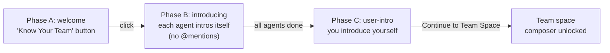
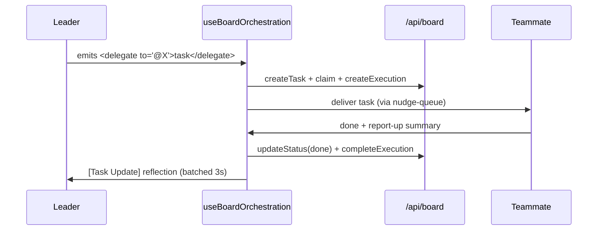

Use this page when you want to talk to a whole [team](/appendices/glossary) at once instead of one agent. Group Chat is a merged transcript across every agent on the team plus [Boo Zero](/appendices/glossary) (the universal team leader). You type one message; Boo Zero triages it, delegates to the right teammates, and synthesizes their work back to you, with each delegation surfacing as a durable card on the [board](/using/board).

Group Chat lives in the bottom half of the **team space**, the split view you land in when you open a team. The top half is the team's [Ghost Graph](/using/ghost-graph); the bottom half is the chat. The chat module is `GroupChatPanel`; its onboarding gate is `TeamOnboardingGate`; its orchestration engine is `useBoardOrchestration`. It is backed by `/api/teams/:id/onboarding`, `/api/team-rules/:teamId`, `/api/chat-history`, and `/api/board`.

## Prerequisites

- A team with at least one agent. Create one from the Marketplace or the team sidebar, see [Using teams](/using/teams).
- A connected runtime so agents can actually run. Group Chat's send path is gated on a live OpenClaw Gateway connection (`canSend` requires `client && connectionStatus === 'connected'`). See [Connecting runtimes](/runtimes/connecting-runtimes).

<Note>
The orchestration engine (`useBoardOrchestration`) is always on; there is no toggle. It is gated only by the connection status and a history-hydration flag, so it stays quiet while the Gateway is down or while past messages are still loading.
</Note>

## Steps

### 1. Open a team's Group Chat

Select a team in the sidebar. When a team is selected and has agents, a **Group Chat** row appears at the top of the agent list (a team-photo button stacking the members' avatars). Click it. Under the hood this calls `openGroupChat(teamId)`, which routes `ContentArea` to the `{ type: 'groupChat', teamId }` view.

`GroupChatView` then swaps between three states, in order:

1. A brief neutral placeholder while onboarding state hydrates from `GET /api/teams/:id/onboarding`.
2. The full-window **Know-Your-Team gate** (no graph yet) when onboarding is incomplete.
3. The settled **team space** split (graph on top, chat on bottom) once onboarding is complete.

A returning team, one that already finished onboarding, lands straight on the split.

### 2. Pass the "Know Your Team" gate (first open only)

The first time you open a team's chat, the gate intercepts before the composer unlocks. It runs once per team to prevent a feedback cascade where every agent would otherwise react to every other agent's introduction. It has three phases (the `Phase` type: `welcome` → `introducing` → `user-intro`):

- **Phase A: Meet your team.** A welcome card shows the team's agents and, when present, a "Led by _Boo Zero_" badge. Click **Know Your Team** (`data-testid="know-your-team-button"`) to begin. The button is disabled until a Gateway `client` is present and the team has agents.
- **Phase B: Agents introduce themselves.** The gate sends a strict introduction prompt to each agent sequentially (one `chat.send` per agent over the team-scoped session). The prompt forbids `@` and teammate references; this is what kills the false-delegation cascade. The gate watches the chat store for a new assistant reply per agent and shows a "_N_ of _M_ done" counter. A refusal-shaped or too-short intro triggers exactly one stronger retry before the gate accepts whatever lands and moves on.
- **Phase C: Your turn.** A textarea (`data-testid="user-intro-textarea"`) asks you to introduce yourself. The submit button reads **Continue to Team Space** (`data-testid="submit-user-intro"`); your intro must be at least 5 characters. On submit, the text is persisted to SQLite via `PATCH /api/teams/:id/onboarding` (the `userIntroText` field, capped at 4000 chars server-side) and best-effort written to each agent's `SOUL.md`. Boo Zero then acknowledges you in-character, and the split opens into the team space.

<Info>
Your self-introduction (`userIntroText`) is the source of truth in SQLite; the `SOUL.md` write is best-effort and may not persist. It is re-injected into the context preamble of every group-chat message, so agents always know who they are talking to, even on the very first message and after long gaps.
</Info>

### 3. Send a message

Type in the composer (placeholder _"Message team… (@name to target)"_) and press Enter. With no `@mention`, the message routes to the team's leader. The routing priority in `sendGroupChatMessage` is:

1. An explicit `@mention` (see the next step).
2. **Boo Zero**, the universal, no-mention default.
3. The team-internal lead (a CTO / Team Lead role detected at deploy time, stored as `team.leaderAgentId`).
4. The first team member.

Before the message reaches the target, `sendGroupChatMessage` assembles a context preamble and prepends, in order: the Boo Zero rules block (only when the target is Boo Zero), the per-team brief (Boo Zero only, from `/api/boo-zero/team-briefs/:teamId`), the team rules block (`/api/team-rules/:teamId`), the merged recent-conversation preamble (including your `userIntroText`), and finally your message. The raw message, `@mention` included, is what shows in the transcript; the assembled context goes only to the Gateway.

### 4. Route with @mentions

Start a message with `@AgentName` to address one teammate directly instead of the leader. `parseMention` only matches an `@` at the **start** of the message, using a longest-prefix, case-insensitive match against the team roster (team members **and** Boo Zero, so `@Boo Zero` works too). The matched name must be followed by whitespace or end-of-string. On a match, the `@mention` is stripped from the message the agent receives, and routing goes to that agent's team-scoped session.

<Tip>
The agent chips below the transcript are shortcuts; clicking one inserts its `@mention` into the composer for you.
</Tip>

### 5. Watch delegations land on the board

When the leader (or any agent) emits a structured delegation, the orchestration engine turns it into a durable **board task** that appears inline in the chat timeline as a `BoardTaskCard`. This is the chat-fused board: the board is canonical, the chat is narration.

A delegation is a structured directive, not prose; the engine reads only typed signals: a `sessions_send` tool-call, or a `<delegate to="@Name">task</delegate>` (or multi-step `<plan>`) directive parsed once from the agent's terminal turn. Per delegation, `useBoardOrchestration` (via the pure `boardOrchestration` core) does this:

- **Derive**: chat to board: the delegation creates a task, atomically claims it for the target, and opens an execution row.
- **Round-trip**: result to board: when the child finishes, its report-up summary and status are written to the board (never the raw transcript).
- **Reflect**: board to chat: completed tasks are batched (a 3-second window) into a single `[Task Update]` delivered back to the leader for synthesis, plus a visible narration entry.

Multiple parallel delegations fan out into N tasks (capped at 8 per turn); a `<plan>` becomes a dependency chain where each step fires when its blocker completes. Delivery routes through a non-destructive nudge-queue, so a message to a busy teammate waits for its turn boundary instead of interrupting an in-flight run. The full model is in [Delegation and orchestration](/concepts/delegation-and-orchestration) and [The board](/using/board).

<Note>
A risky-looking delegation (matching keywords like `delete`, `deploy`, `publish`, `rm -rf`, `secret`, `api_key`) is surfaced on the leader's approval queue via `POST /api/governance/delegation-approval` before it runs. Routine delegations never touch this path. The gate fails closed: an unreachable approval endpoint does **not** auto-approve.
</Note>

### 6. Stop a runaway team

While any agent is running or streaming, the composer's Send button morphs into a red **Stop** button (`data-testid="chat-stop-button"`). Clicking it does two things at once:

1. Bumps a monotonic `stopSignal` counter; `useBoardOrchestration` watches this and bails its in-flight delegation work at the next checkpoint (without tearing down the observers).
2. Calls `stopAllInTeam`, which optimistically flips every running participant to idle locally, then fires `chat.abort` per running agent and `sessions.abort` per session as a backstop, and clears the in-memory wake/override state.

The result is an immediate UI stop plus a hard cancel of queued and in-flight work, so a stopped team does not restart its cascade one beat later.

### 7. Capture a durable team rule with `/rule`

Type `/rule <text>` in the composer to add a durable rule for this team. `handleSend` intercepts it **before** routing to any agent: it appends the line to the team's rules in SQLite (`PUT /api/team-rules/:teamId`), drops one confirmation meta entry into the merged transcript, and short-circuits; nothing is sent to the Gateway. The prefix must be `/rule` followed by a space and a non-empty body (so `/rules` or a bare `/rule` does not misfire).

Team rules are loaded and prepended to the context preamble on every future message (wrapped as `[Team Rules — set by the user, authoritative]`), so a correction like `/rule don't do work yourself, delegate via <delegate>` survives across sessions instead of rolling out of the recent-message window. The same rules text is also editable from the team's Brief & Rules panel, see [Boo Zero](/using/boo-zero).

## Options / variations

| Action                      | How                       | What it does                                                                        |
| --------------------------- | ------------------------- | ----------------------------------------------------------------------------------- |
| Address the leader          | Send with no `@`          | Routes to Boo Zero (default), then team-internal lead, then first member            |
| Address one teammate        | `@AgentName your message` | Longest-prefix match at message start; `@mention` stripped before the agent sees it |
| Address Boo Zero explicitly | `@Boo Zero …`             | Boo Zero is in the mention roster even though it is teamless                        |
| Add a durable rule          | `/rule <text>`            | Persists to `/api/team-rules/:teamId`; injected on every future message             |
| Stop the team               | Click the red Stop button | Bumps `stopSignal` + `chat.abort`/`sessions.abort` per running agent/session        |
| Insert a mention            | Click an agent chip       | Inserts `@AgentName` into the composer                                              |

## Verify it worked

- After the gate, the composer unlocks and the placeholder reads _"Message team… (@name to target)"_. Re-fetch `GET /api/teams/:id/onboarding`; both `agentsIntroduced` and `userIntroduced` should be `true`, and `userIntroText` should hold your introduction.
- Send a message that prompts a delegation; a `BoardTaskCard` should appear inline (assignee avatar, status badge, title) and progress from `in_progress` to `done`. Cross-check `GET /api/board?teamId=<id>`; the same task is there.
- A `/rule …` message should drop a "Rule saved for team" confirmation and show up in `GET /api/team-rules/:teamId`.

## Troubleshooting

<Warning>
**The composer is disabled.** `canSend` requires a Gateway `client`, `connectionStatus === 'connected'`, at least one team agent, and no agent currently running. If the Gateway is offline, the send path stays disabled and orchestration stays quiet. Reconnect from the Runtimes panel.
</Warning>

<Warning>
**An agent's intro shows "Thinking…" forever in Phase B.** The gate retries a refusal-shaped or too-short intro exactly once, then accepts whatever lands so onboarding can advance. If an agent never replies at all, the gate stays on that agent; confirm the runtime is connected and the agent has a session.
</Warning>

<Danger>
**Old chat history replaying as new delegations.** Orchestration is gated on a history-hydration flag: `useBoardOrchestration` is enabled only after every participant's `/api/chat-history` fetch resolves (with a 5-second safety timeout), so hydrated entries are never treated as new work. If you see stale activity on team open, that gate is the thing to check.
</Danger>

## Related

- [Peer chat](/concepts/peer-chat), the mixed-runtime room model under the team chat
- [Delegation and orchestration](/concepts/delegation-and-orchestration), structured tags, no-regex, the board-driven engine
- [The board](/using/board), the durable kanban the delegations land on
- [Using teams](/using/teams) · [Boo Zero](/using/boo-zero), team setup, leaders, briefs, and rules
- [Connecting runtimes](/runtimes/connecting-runtimes), bring a runtime online so agents can run
