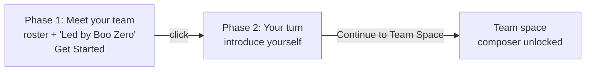

Use this page when you want to talk to a whole [team](/appendices/glossary) at once instead of one agent. Group Chat is a merged transcript across every agent on the team plus [Boo Zero](/appendices/glossary) (the universal team leader). You type one message; Boo Zero triages it, delegates to the right teammates, and synthesizes their work back to you, with each delegation surfacing as a durable card on the [board](/using/board).

Group Chat lives in the bottom half of the **team space**, the split view you land in when you open a team. The top half is the team's [Ghost Graph](/using/ghost-graph); the bottom half is the chat. Orchestration runs **server-side**: the browser posts your message, streams the result back over Server-Sent Events, and renders it. The chat module (`GroupChatPanel`) is backed by `POST` / `GET` / `POST` on `/api/teams/:id/chat`, `/api/teams/:id/chat/stream`, and `/api/teams/:id/chat/stop`, plus `/api/teams/:id/onboarding`, `/api/team-rules/:teamId`, `/api/chat-history`, and `/api/board`.

## Prerequisites

- A team with at least one agent. Create one from the Marketplace or the team sidebar, see [Using teams](/using/teams).
- A connected runtime so agents can actually run. A native team needs a provider key connected; an OpenClaw team needs its Gateway connected. See [Connecting runtimes](/runtimes/connecting-runtimes).

<Note>
The composer is live whenever the team has agents and nothing is currently running; it does **not** require a live OpenClaw Gateway connection. A native-only team (no Gateway) sends and receives exactly the same way, because the orchestration engine runs on the server, not in the browser.
</Note>

## Steps

### 1. Open a team's Group Chat

Select a team in the sidebar. When a team is selected and has agents, a **Group Chat** row appears at the top of the agent list (a team-photo button stacking the members' avatars). Click it. Under the hood this calls `openGroupChat(teamId)`, which routes `ContentArea` to the `{ type: 'groupChat', teamId }` view.

`GroupChatView` then swaps between three states, in order:

1. A brief neutral placeholder while onboarding state hydrates from `GET /api/teams/:id/onboarding`.
2. The full-window **Know-Your-Team gate** (no graph yet) when onboarding is incomplete.
3. The settled **team space** split (graph on top, chat on bottom) once onboarding is complete.

A returning team, one that already finished onboarding, lands straight on the split.

### 2. Pass the "Know Your Team" gate (first open only)

The first time you open a team's chat, a one-time gate intercepts before the composer unlocks. It runs once per team, and it has two phases (the `Phase` type: `welcome` then `user-intro`):

- **Phase 1: Meet your team.** A welcome card shows the team's agents and, when present, a "Led by _Boo Zero_" badge. The copy explains that your team is led by Boo Zero, who takes your request and routes it to the right specialist, so you don't need to learn every teammate up front. Click **Get Started** (`data-testid="know-your-team-button"`).
- **Phase 2: Your turn.** A textarea (`data-testid="user-intro-textarea"`) asks you to introduce yourself. The submit button reads **Continue to Team Space** (`data-testid="submit-user-intro"`); your intro must be at least 5 characters. On submit, the text is persisted to SQLite via `PATCH /api/teams/:id/onboarding` (the `userIntroText` field, capped at 4000 chars server-side). Boo Zero then acknowledges you in-character, and the split opens into the team space.

<Info>
There is no agent-introduction round; a team's agents are understood from the welcome (roster plus leader) and, more importantly, from the first real task's live delegation. Cascade prevention is built into the server orchestrator, so the gate no longer needs to sequence introductions to stay safe. Your self-introduction (`userIntroText`) is the source of truth in SQLite; it is re-injected into every group-chat turn's context, so agents always know who they are talking to, even on the very first message and after long gaps.
</Info>

### 3. Send a message

Type in the composer and press Enter. With no `@mention`, the message routes to the team's leader. The routing priority is:

1. An explicit `@mention` (see the next step).
2. **Boo Zero**, the universal, no-mention default.
3. The team-internal lead (a CTO / Team Lead role detected at deploy time, stored as `team.leaderAgentId`).
4. The first team member.

The client resolves that target and posts your message to `POST /api/teams/:id/chat`, which returns immediately (202) while the work proceeds on the server. Before the message reaches the target, the **server** assembles a context preamble and prepends the team's durable rules and your `userIntroText` (and the live roster) to the turn, so a correction or who-you-are persists across the conversation. The raw message, `@mention` included, is what shows in the transcript; the assembled context goes only to the runtime. Responses stream back live over `GET /api/teams/:id/chat/stream`.

### 4. Route with @mentions

Start a message with `@AgentName` to address one teammate directly instead of the leader. `parseMention` only matches an `@` at the **start** of the message, using a longest-prefix, case-insensitive match against the team roster (team members **and** Boo Zero, so `@Boo Zero` works too). The matched name must be followed by whitespace or end-of-string. On a match, the `@mention` is stripped from the message the agent receives, and routing goes to that agent.

<Tip>
The agent chips below the transcript are shortcuts; clicking one inserts its `@mention` into the composer for you.
</Tip>

### 5. Watch delegations land on the board

When the leader (or any agent) emits a structured delegation, the server orchestrator turns it into a durable **board task** that appears inline in the chat timeline as a `BoardTaskCard`. This is the chat-fused board: the board is canonical, the chat is narration.

A delegation is a structured directive, not prose; the engine reads only typed signals: a `delegate` or `sessions_send` tool-call, or a `<delegate to="@Name">task</delegate>` (or multi-step `<plan>`) directive parsed once from the agent's terminal turn. Per delegation, the per-team server orchestrator (`getTeamOrchestrator`, over the shared `createBoardOrchestrator` core) does this:

- **Derive**: chat to board: the delegation creates a task, atomically claims it for the target, and opens an execution row.
- **Round-trip**: result to board: when the child finishes, its report-up summary and status are written to the board (never the raw transcript).
- **Reflect**: board to chat: completed tasks are batched (a 3-second window) into a single `[Task Update]` delivered back to the leader for synthesis, plus a visible narration entry.

Board task cards update **live** as the cascade runs (the board projection streams over the same connection), so you watch a plan's steps advance without a refresh. Multiple parallel delegations fan out into N tasks (capped at 8 per turn); a `<plan>` becomes a dependency chain where each step fires when its blocker completes. Delivery routes through a non-destructive nudge-queue, so a message to a busy teammate waits for its turn boundary instead of interrupting an in-flight run. Because the engine runs server-side, the cascade keeps going even if you close the tab, and it is all still there when you reopen. The full model is in [Delegation and orchestration](/concepts/delegation-and-orchestration) and [The board](/using/board).

<Note>
A risky-looking delegation (matching keywords like `delete`, `deploy`, `publish`, `rm -rf`, `secret`, `api_key`) is surfaced on the leader's approval queue via `POST /api/governance/delegation-approval` before it runs. Routine delegations never touch this path. The gate fails closed: an unreachable approval endpoint does **not** auto-approve.
</Note>

### 6. Stop a runaway team

While any agent is running or streaming, the composer's Send button morphs into a red **Stop** button (`data-testid="chat-stop-button"`). Clicking it posts to `POST /api/teams/:id/chat/stop`, which bumps the server's stop generation and aborts every in-flight run for the team, then cleanly releases each task back to `todo` (it is re-runnable, not blocked, and no failure is reflected). The UI flips to idle immediately, and because the stop happens on the server, a stopped team does not restart its cascade one beat later.

### 7. Capture a durable team rule with `/rule`

Type `/rule <text>` in the composer to add a durable rule for this team. The rule is saved to SQLite (`PUT /api/team-rules/:teamId`), a confirmation entry drops into the transcript, and nothing is routed to an agent. The prefix must be `/rule` followed by a space and a non-empty body (so `/rules` or a bare `/rule` does not misfire).

Team rules are loaded and prepended to the context preamble on every future turn (wrapped as an authoritative `Team Rules` block, set by you), so a correction like `/rule don't do work yourself, delegate via <delegate>` survives across sessions instead of rolling out of the recent-message window. The same rules text is also editable from the team's Brief & Rules panel, see [Boo Zero](/using/boo-zero).

## The peer-chat room

Every team also has a durable **peer-chat room**, where each runtime posts as a named peer, opened from the toggle in the team header. It is a **read-only** view: peers post to the room through their TeamChat MCP tool as they coordinate, not from this panel, and you watch. It is the "one room, any runtime can lead" surface, distinct from the user-facing group chat above (where you type). See [Peer chat](/concepts/peer-chat) for the model.

## Options / variations

| Action                      | How                       | What it does                                                                        |
| --------------------------- | ------------------------- | ----------------------------------------------------------------------------------- |
| Address the leader          | Send with no `@`          | Routes to Boo Zero (default), then team-internal lead, then first member            |
| Address one teammate        | `@AgentName your message` | Longest-prefix match at message start; `@mention` stripped before the agent sees it |
| Address Boo Zero explicitly | `@Boo Zero …`             | Boo Zero is in the mention roster even though it is teamless                        |
| Add a durable rule          | `/rule <text>`            | Persists to `/api/team-rules/:teamId`; injected on every future turn                 |
| Stop the team               | Click the red Stop button | `POST /api/teams/:id/chat/stop`: aborts in-flight runs, releases tasks to `todo`     |
| Insert a mention            | Click an agent chip       | Inserts `@AgentName` into the composer                                              |
| Open the peer-chat room     | Toggle in the team header | A read-only view of the durable room where runtimes post as named peers             |

## Verify it worked

- After the gate, the composer unlocks and accepts input. Re-fetch `GET /api/teams/:id/onboarding`; both `agentsIntroduced` and `userIntroduced` should be `true`, and `userIntroText` should hold your introduction.
- Send a message that prompts a delegation; a `BoardTaskCard` should appear inline (assignee avatar, status badge, title) and progress from `in_progress` to `done`. Cross-check `GET /api/board?teamId=<id>`; the same task is there.
- A `/rule …` message should drop a "Rule saved for team" confirmation and show up in `GET /api/team-rules/:teamId`.

## Troubleshooting

<Warning>
**The composer is disabled.** The composer is enabled when the team has at least one agent and no run is currently in flight. If it stays disabled, confirm the team has agents; while the team is working, Send is intentionally replaced by Stop. A native team does **not** need a Gateway connection to send.
</Warning>

<Warning>
**A response never streams back.** The stream is `GET /api/teams/:id/chat/stream` (SSE). If nothing appears after you send, confirm the runtime the target agent runs on is connected (a native team needs its provider key; an OpenClaw team needs its Gateway) and check the server logs. The message was accepted (202) as soon as you sent it; the work runs server-side regardless of the browser.
</Warning>

<Danger>
**Old chat history replaying as new work.** Orchestration runs on the server and is keyed to the durable board, not to what the browser last saw, so reopening a team never replays hydrated history as new delegations. If you see stale activity on team open, it is the live stream catching you up on work that actually ran, not a re-fire.
</Danger>

## Related

- [Peer chat](/concepts/peer-chat), the mixed-runtime room model under the team chat
- [Delegation and orchestration](/concepts/delegation-and-orchestration), structured tags, no-regex, the board-driven engine
- [The board](/using/board), the durable kanban the delegations land on
- [Using teams](/using/teams) · [Boo Zero](/using/boo-zero), team setup, leaders, briefs, and rules
- [Connecting runtimes](/runtimes/connecting-runtimes), bring a runtime online so agents can run
