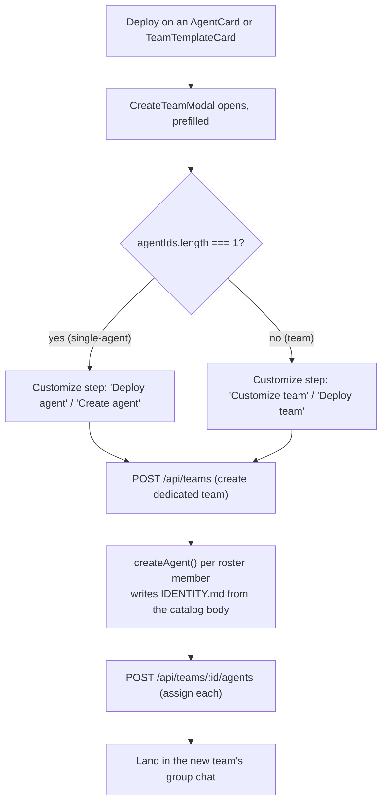

Use this page when you want to add agents to your fleet: either one specialist at a time or a pre-wired [team](/appendices/glossary). The **Marketplace** is a curated catalog of 436 agents, 85 teams, and 44 skills you can browse and deploy with two clicks.

The catalog is hand-maintained JSON packs: **two written for Clawboo and seventeen adapted from permissively licensed upstream projects** (sixteen MIT, one Apache-2.0), each pinned to a commit. Most of what you browse is community work that Clawboo curated and adapted, not content Clawboo authored; every entry names its author, licence and pinned commit on its detail sheet (see [Marketplace catalog reference](/reference/marketplace-catalog)). What this page covers is the dashboard surface that browses it: the three tabs, the search and filter controls, the detail modals, and the two deploy paths. The UI is `MarketplacePanel`; deploying funnels into the same team-create + agent-create pipeline documented in [Teams](/using/teams).

> **Community content.** Clawboo checks each pack's licence, pins every import to a commit, verifies a content digest, and scans for known prompt-injection patterns. It does not audit what an agent will do once deployed, and it does not vouch for third-party content. Review anything you deploy, the same as you would on any other marketplace.

## Prerequisites

<Note>
The Marketplace is browsable with no Gateway and no runtime connected. The agent and team content is served by the local dashboard itself, which merges a built-in pack that is compiled into the app (15 agents and 5 teams) with any pack it has fetched and verified, so those built-ins are there even with no network at all. **Deploying** an agent or team requires a connected runtime (Clawboo Native or OpenClaw) so the new [Boo](/appendices/glossary) records can actually be created.
</Note>

- A connected runtime to deploy into: see [Connecting runtimes](/runtimes/connecting-runtimes) or the [Native quickstart](/getting-started/quickstart-native).
- Nothing to install. The packs live under the repository's `catalog/` folder rather than inside the app bundle; the dashboard fetches and verifies them at runtime through its own API.

## Where it lives

Open the Marketplace from the **Marketplace** nav button (shopping-cart icon) in the left sidebar, or press **Cmd/Ctrl + 3**. The panel fills the content area with a toolbar (the three tab toggles + sort), a filter bar, and a responsive card grid.

The panel opens on the **Teams** tab by default. The toolbar shows all three tab toggles with live counts: `Teams (85)`, `Agents (436)`, `Skills (44)`. Each tab keeps its own search query and filters, so switching tabs never loses your place.

## The three tabs

| Tab        | Count | What it lists                                                          | Default? |
| ---------- | ----- | ---------------------------------------------------------------------- | -------- |
| **Teams**  | 85    | Pre-wired `TeamTemplate`s (a roster of agents + routing)               | yes      |
| **Agents** | 436   | Individual `AgentIndexEntry` records, one specialist each              | no       |
| **Skills** | 44    | `CatalogSkill` capability annotations you can add to an existing agent | no       |

### Teams tab

The default view. Each team renders as a `TeamTemplateCard` showing its emoji, name, agent count, a pack badge, a category label, a **Community** badge when that pack is adapted community work, the description, and the agent roles in the roster. Buttons: **Details** and **Deploy**. The grid leads with a **Curated teams** banner and a **Start from scratch** card (deploy a blank custom team); this tab is also where the sidebar's **+** create-team button lands.

### Agents tab

Each agent renders as an `AgentCard` showing its mascot avatar, name, role, a pack badge, a category label, a **Community** badge when that pack is adapted community work, a two-line description, and a stats line (`N skills • in N teams`). Two buttons: **Details** (opens the detail modal) and **Deploy** (creates the agent in a dedicated team).

### Skills tab

Each skill renders as a `SkillCard` with a category dot, a neutral **Curated** tag (hand-maintained in this repo rather than fetched from an external skill registry), a two-line description, and an **Add** button. When a skill is used by catalog agents, a `Used by N agents` link appears that cross-jumps to the Agents tab pre-searched on that skill name.

<Note>
Adding a skill is different from deploying an agent. **Add** records a **capability annotation** on an *existing* agent in your fleet (you pick the target from a dropdown); it `POST`s to `/api/skills`, which injection-scans the entry before recording it. The annotation surfaces on the [Ghost Graph](/using/ghost-graph) and the [Capabilities dashboard](/using/capabilities-dashboard) — it labels intent, it does **not** provision a runtime tool (an agent's executable tools come from the MCP broker). Deploying an agent or team *creates new Boos*.
</Note>

<Note>
Connectors used to be a fourth tab here. It is now its own sidebar destination, directly under **Marketplace**. The three tabs above are a catalog you browse once; connecting the tools your agents use is a recurring errand, and it was three clicks deep. See [Connectors](/using/connectors).
</Note>

## Search and filters

Each tab has its own search box and filter pills. Search is a case-insensitive substring match; it never hits the network.

| Tab    | Search matches                   | Filter pills                                                                                 |
| ------ | -------------------------------- | -------------------------------------------------------------------------------------------- |
| Agents | name · role · description · tags | **Category** (only categories with ≥ 1 agent, busiest first) + **Pack**                      |
| Teams  | name · description · tags        | **Category** (only categories with ≥ 1 team, busiest first) + **Pack**                       |
| Skills | name · description · tags        | **Category** (Code / File / Web / Comm / Data / Other) + sort dropdown (Name A–Z · Category) |

The **Pack** filter (shared by Agents and Teams) is derived from the catalog rather than hardcoded: it renders **All** plus one pill per pack the index carries, so a pack added later appears on its own. That is twenty pills today. Five of them, to show the shape:

| Pack pill                  | Meaning                                              |
| -------------------------- | ---------------------------------------------------- |
| Clawboo                    | the hand-written first-party built-ins               |
| Clawboo Life and Home      | the first-party life-and-home pack                   |
| Agency Agents              | adapted from the `agency-agents` upstream (MIT)      |
| Engineering Agents         | adapted from the `wshobson/agents` upstream (MIT)    |
| Research and Orchestration | adapted from the VoltAgent subagent collection (MIT) |

The [Marketplace catalog reference](/reference/marketplace-catalog) lists all nineteen packs with their labels, licences and pinned commits.

Filters compose with search: the result set is `search(query)` then narrowed by the active category pill and the active pack pill. When nothing matches, the grid shows an empty state with a **Clear filters** button that resets that tab's search and pills.

## The detail modals

Both **Details** buttons open a modal you can dismiss with **Escape** or the close button.

### Agent detail (the full identity view)

`AgentTemplateDetail` shows the agent's avatar, name, role, pack and category badges, a **Where this came from** provenance block (the author, the licence, and the pinned commit), the full description, a source-attribution link, **clickable skill chips**, **"Appears in N teams" chips**, and, the payoff, the agent's **full `IDENTITY.md` rendered as Markdown**.

What you read is what deploys: the catalog stores each entry's whole instruction body, never a summary, and that exact text is what lands in the agent's `IDENTITY.md`. Entries adapted from an upstream repository are edited, not copied verbatim, and each links back to its source file.

The chips are cross-reference shortcuts:

- Clicking a **skill chip** jumps to the Skills tab, pre-searched on that skill.
- Clicking a **team chip** jumps to the Teams tab, pre-searched on that team.

A **Deploy** button at the bottom runs the same single-agent deploy as the card.

### Team detail

`TeamTemplateDetail` shows the team's emoji, name, pack badge, category, the same **Where this came from** provenance block, description, source-attribution link, an optional expandable **Workflow** narrative, and the **full roster**: each agent with its avatar, role, parsed skills, and parsed `@`-mention routing (so you can see who delegates to whom before deploying). It also has a **Deploy** button.

## Deploy

Both deploy paths open the same `CreateTeamModal` and end at the same team-create + agent-create pipeline. The difference is how many agents land and how the modal is labeled.

### Deploy a single agent

Click **Deploy** on an `AgentCard` (or in the agent detail modal). Clawboo wraps that one agent into an adhoc one-agent `TeamTemplate` (id `adhoc-<agentId>`) and opens `CreateTeamModal`. The modal detects single-agent mode by shape (`agentIds.length === 1`) and relabels the Customize step; the title reads **"Deploy agent"** and the confirm button reads **"Create agent"**, and the pick step is skipped.

The deploy loop is otherwise identical to a team deploy: it always creates a dedicated team for that one agent, then creates the agent inside it. (A single-agent deploy is just a one-member team.)

### Deploy a team

Click **Deploy** on a `TeamTemplateCard` (or in the team detail modal). `CreateTeamModal` opens pre-filled with the template's name, emoji, and color, skipping the pick step. The Customize step lets you rename/recolor; the confirm button reads **"Deploy team"**. On confirm it:

1. `POST`s `/api/teams` to create the team (with a client-minted UUID so the preview palette matches the deployed team).
2. Calls `createAgent()` for each roster member, writing the catalog entry's whole `IDENTITY.md` body to that Boo's own `IDENTITY.md`.
3. `POST`s `/api/teams/:id/agents` to assign each new Boo to the team.

When the modal finishes, Clawboo selects the new team and opens its **group chat** so you can use it immediately. See [Teams](/using/teams) for managing the team afterward (leaders, rules, color collections).

## Verify it worked

- After a deploy, the dashboard switches you into the new team's group chat. The team appears in the team sidebar and the [Ghost Graph](/using/ghost-graph).
- Open the agent in the fleet; its **IDENTITY.md** should contain the same source text you saw in the agent detail modal.
- After you **Add** a skill, a success toast confirms it (_"Added … to … tool profile"_), and the skill appears as a capability annotation on the agent in the [Capabilities dashboard](/using/capabilities-dashboard) and on the Ghost Graph.

## Troubleshooting

<Warning>
**Some roster agents are missing after a deploy.** A per-agent create failure does not abort the run: the loop records the name, continues through the rest of the roster, and ends with an error toast reading `N of M agents created (… failed)`. If nothing at all was created, the modal drops back to the Customize step with _"No agents could be created. Check that the runtime is connected, then retry."_ and leaves the empty team row in place so you can retry or delete it. A **name collision is not a failure mode**: before creating anything, the deploy computes the smallest free numeric suffix and applies it to the team and every roster agent (`Code Reviewer Boo 2`), rewriting the `@`-mention routing to match, so you never need to rename an existing agent or deploy into a fresh fleet. See [Teams](/using/teams).
</Warning>

<Warning>
**A skill install returns an error toast.** `POST /api/skills` injection-scans every entry first. A destructive / exfiltration / prompt-injection finding blocks the install with a `422` (the toast shows the finding), and the block is recorded in the governance audit log. This is the supply-chain guard; it is intentional, not a bug.
</Warning>

<Note>
**Counts won't change after deploy.** The `Teams (85)` / `Agents (436)` / `Skills (44)` toolbar counts are the *catalog* size, not your fleet. They are fixed; deploying does not grow them.
</Note>

## See also

- [Teams](/using/teams): manage a team after you deploy it (leaders, rules, color collections)
- [Ghost Graph](/using/ghost-graph): see the deployed agents and their routing
- [Capabilities dashboard](/using/capabilities-dashboard): where installed skills surface
- [Agents](/using/agents): edit a deployed agent's SOUL / IDENTITY / TOOLS / AGENTS files
- [Marketplace catalog reference](/reference/marketplace-catalog): the pack format, the nineteen packs, pinned SHAs, and the fetch-and-verify path
