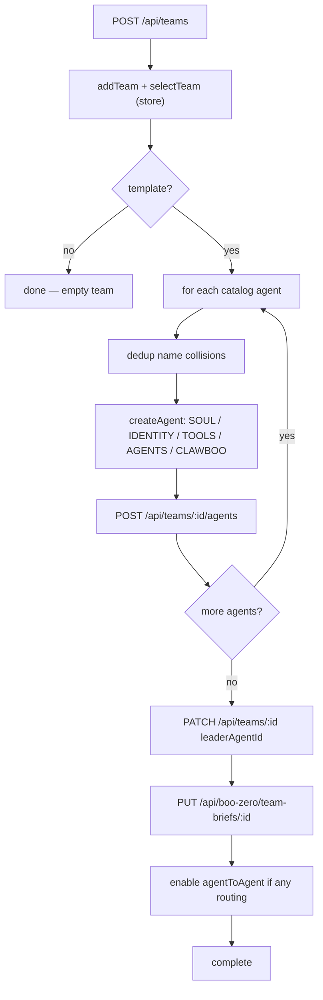

Use this page when you want to group [Boos](/appendices/glossary) into a team, the unit Clawboo coordinates as one chat room and one shared plane. A team is a row in SQLite (`teams`) plus the agents whose `team_id` points at it; everything else (the group chat, the [Ghost Graph](/using/ghost-graph) scope, [Boo Zero](/using/boo-zero)'s per-team brief, the durable rules) hangs off that row.

You manage teams from two places in the dashboard: the **team sidebar** (the leftmost 60px column, `TeamSidebar`) for creating, switching, archiving, and deleting, and the **team header** inside a team's group chat (`GroupChatViewHeader`) for its brief and rules. Both are backed by `/api/teams*` and `/api/team-rules/*`.

For a guided first run, start with [Deploy your first team](/getting-started/first-team). For the conceptual model (why a team has a shared plane and a private plane), see [Teams and planes](/concepts/teams-and-planes).

## Prerequisites

<Note>
A team is a Clawboo-native record. Deploying a populated template creates each agent through the runtime you pick for it: a **Clawboo Native** or coding-runtime agent is created server-side with no OpenClaw Gateway, while an agent you put on **OpenClaw** needs a live Gateway connection. Because an unavailable OpenClaw suggestion degrades to Clawboo Native, a marketplace team still deploys fully native when the Gateway is offline. Creating an *empty* team and a template with zero agents both work with nothing connected.
</Note>

- The dashboard is open and connected (see [Connecting runtimes](/runtimes/connecting-runtimes) or the OpenClaw quickstart).
- Optional: a [marketplace](/using/marketplace) template in mind. The catalog ships 82 teams across four sources (`clawboo`, `agency-agents`, `awesome-openclaw`, plus synthetic excellence teams).

## Steps

### 1. Open the team browser

In the team sidebar, click the dashed **+** button (`title="Create a team"`). It takes you to the **Marketplace → Teams** tab, the one canonical place to browse and deploy a team. Press **Deploy** on any team card (or the **Start from scratch** card, for a blank team) to open `CreateTeamModal` at its **customize** step.

The modal is a four-step flow (**pick → customize → deploy → complete**), but the **pick** step only appears on the first-run welcome screen, before you have any teams; every other entry, the marketplace **Deploy** buttons and **Start from scratch**, jumps straight to **customize**. When the pick step does show, it renders the same team showcase described next.


### 2. Browse the team showcase

The Teams tab, and the first-run pick step, list the team catalog with a search box and two filter rows:

- **Category pills**: the popular categories inline, the rest folded under a **+N more** toggle; only categories that actually have templates render.
- **Source pills**: `All`, `Clawboo`, `Agency Agents`, `Awesome OpenClaw`, each with a colored dot.

Press **Deploy** on a team card to advance to **customize** pre-filled with that template's name, icon, and color. Press the **Start from scratch** card to advance with a blank `New Team` / `👻` placeholder and no agents.

### 3. Customize the team

The **customize** step has three sections:

| Field                   | What it sets                                                                             | Stored as                    |
| ----------------------- | ---------------------------------------------------------------------------------------- | ---------------------------- |
| **Name**                | The team's display name                                                                  | `teams.name`                 |
| **Team badge**          | The icon (tap the badge to open the icon picker) and accent color (icon + halo tint)     | `teams.icon`, `teams.color`  |
| **Teammate colors**     | A _color collection_ that colors every teammate's Boo avatar, with a live roster preview | `teams.colorCollectionId`    |
| **Runtime (per agent)** | The runtime each roster agent runs on, chosen from a per-row dropdown                     | `agents.runtime` (at create) |
| **Model (per agent)**   | The model an agent runs on, from a dropdown next to its runtime (Native, OpenClaw, and Hermes) | native `AgentConfig.primaryModel`; OpenClaw `agents.list[]` override; Hermes `execConfig` (via OpenRouter) |

The accent color and the teammate color collection are independent: the accent tints the team badge and its [Ghost Graph](/using/ghost-graph) halo, while the collection decides how the member Boos are colored. The roster preview seeds its palette with a client-minted team id so the colors you see here match the deployed team exactly (per-team hue rotation).

The eight color collections are `vivid-pop`, `dusty-pastel-pro`, `coastal-mist`, `executive-jewel`, `sharp-saas`, `soft-neutral-editorial`, `monochrome-accent`, and `classic`. `classic` is the default and uses the legacy per-Boo tints (it ignores the hue-rotation seed).

Every agent in the roster preview also carries its own **runtime** dropdown, Clawboo Native, OpenClaw, or any connected coding runtime (Claude Code, Codex, Hermes), so one team can mix runtimes; there is no separate "native team vs OpenClaw team" choice. Each row defaults to a smart suggestion (a marketplace team suggests OpenClaw, a blank team suggests Clawboo Native) that degrades to Clawboo Native with an inline note when the suggested runtime is not connected, so the deploy always succeeds. A genuine leadership role is badged **Leader**, but every agent, the leader included, picks its own runtime; clicking a disabled OpenClaw option opens the OpenClaw setup flow in Settings.

Agents on **Clawboo Native**, **OpenClaw**, and **Hermes** also get an inline **model** dropdown beside the runtime pill (Hermes routes every model through OpenRouter, so its dropdown is the live OpenRouter catalog; **Codex** and **Claude Code** run the delegated task with their own account/SDK default and have no picker). It defaults to **Recommended** (native leaves the model to the tier default; OpenClaw leaves it to the team's default model), and each runtime shows its own catalog, so a native pick lands on `AgentConfig.primaryModel`, an OpenClaw pick writes a per-agent override into `openclaw.json`, and a Hermes pick is stored in the agent's `execConfig`. Switching a row's runtime clears its model pick, since a model id belongs to one runtime's catalog. You can change any agent's model later from its [detail view](/using/agents).

The footer button is the primary action; its label changes with context: **Create team** (empty), **Deploy team** (template), or **Create agent** (single-agent deploy from the marketplace's agent "Deploy" button).

### 4. Deploy

Pressing the action button issues `POST /api/teams`. The request includes the client-minted `id` (a UUID, so the deployed palette matches the preview), `name`, `icon`, `color`, `colorCollectionId`, and `templateId`. The handler validates the id against a UUID regex and falls back to a server-minted id otherwise. `name`, `icon`, and `color` are all required; omit any and the route returns `400`.

For an **empty** team the modal closes immediately. For a **template** team the modal enters the **deploy** step and creates each agent in order:



Along the way the deploy loop also:

- **Deduplicates names** against your existing agents and teams (auto-suffixing on a collision) so a second deploy of the same template does not clash.
- **Writes per-agent files**: `SOUL.md`, `IDENTITY.md`, `TOOLS.md`, an enhanced `AGENTS.md` (team roster + collaboration protocol), and a workspace-root `CLAWBOO.md` reference.
- **Generates Boo Zero's per-team brief** (`PUT /api/boo-zero/team-briefs/:id`, best-effort).
- **Enables agent-to-agent coordination** (`PATCH /api/system/openclaw-config { agentToAgent: { enabled: true } }`) if any agent's `AGENTS.md` has `@`-routing, non-fatal if it fails.

When the loop finishes you land in the new team's group chat.

## Leaders

A team's leader is **not** forced to the first agent. Clawboo's model is:

- **Boo Zero is the universal leader of every team.** It is teamless in the database and participates in each team via a team-scoped session.
- **`teams.leaderAgentId` is the optional _team-internal lead_**, a second-tier coordinator that sits below Boo Zero. The deploy loop sets it only when it detects a genuine leadership role in the roster (CTO, Team Lead, and similar archetypes). When no leader role is detected, the `PATCH /api/teams/:id` writes `null` so the column stays accurate on re-deploys.

At runtime, `resolveTeamLeader` resolves the effective leader in priority order: Boo Zero if it exists in the fleet, else the team-internal lead if it is a member of this team, else the first member, else `null` (an empty team with no Boo Zero).

<Note>
To change the internal lead later, `PATCH /api/teams/:id` with `{ "leaderAgentId": "<agentId>" }` (or `null` to clear it). The PATCH body accepts any subset of `name`, `icon`, `color`, `colorCollectionId`, `isArchived`, and `leaderAgentId`.
</Note>

## Team rules

Team rules are durable, user-set instructions injected into the message preamble for **every team agent and every Boo Zero turn in this team**. They exist because corrections you type in chat ("you are not sub-agents", "delegate via `<delegate>`, don't do the work yourself") roll out of the last-few-messages context window and get forgotten; rules survive across sessions. They are stored in the `settings` table under the key `team-rules:<teamId>`, capped at 4000 characters server-side.

There are two ways to set them.

### From the rules editor (gear in the team header)

Inside a team's group chat, click **Brief & Rules** (the gear button in `GroupChatViewHeader`). This opens `TeamSettingsSheet`, which stacks the team's icon/accent/collection pickers, the per-team **Brief**, and the **Rules** editor.

The Rules editor (`TeamRulesEditor`) is a plain textarea, one rule per line. It loads via `GET /api/team-rules/:teamId` and saves the whole text via `PUT /api/team-rules/:teamId` with `{ content }`. The Save button is disabled until the content is dirty.

### From the `/rule` slash command

In the team chat composer, type `/rule <text>` and send. This is intercepted **before** the message is routed to any agent:

```text
/rule delegate via <delegate>, don't do the work yourself
```

The handler fetches the current rules, appends your text as a new `- ` line (deduping an exact duplicate, case-insensitively), and saves via `PUT /api/team-rules/:teamId`. It drops one `meta` confirmation entry into the merged team transcript and shows a toast; the message is never sent to a runtime.

<Info>
The `/rule ` prefix must be followed by whitespace and a non-empty body. `/rule` alone, `/rules`, or `/rule:` do not trigger the command; they fall through and are sent as a normal message.
</Info>

## Color collections

Two color choices are independent:

- The **accent color** (`teams.color`) tints the team badge in the sidebar and the team's Ghost Graph halo. Pick it in the customize step or later in the settings sheet (`TeamAccentPicker`).
- The **color collection** (`teams.colorCollectionId`) decides how member Boos are colored. Pick it with `TeamColorCollectionPicker` in the customize step or the settings sheet. The roster preview updates live.

Both the customize step and the settings sheet write the collection through `PATCH /api/teams/:id` (the sheet does it optimistically; the store updates first, then persists).

## Archive and delete

Right-click a team's icon in the sidebar to open `TeamContextMenu`. It has four actions:

| Action                      | What it does                                                                           | Route                                      |
| --------------------------- | -------------------------------------------------------------------------------------- | ------------------------------------------ |
| **Archive** / **Unarchive** | Hides the team from the active list (toggles `isArchived`) without touching agents     | `PATCH /api/teams/:id` `{ isArchived }`    |
| **Refresh Protocol**        | Regenerates each member's `AGENTS.md` with the current roster + collaboration protocol | per-agent file writes (needs a connection) |
| **Delete team only**        | Deletes the team and **orphans** its agents (sets each member's `team_id` to `null`)   | `DELETE /api/teams/:id`                    |
| **Delete with agents**      | Deletes the agents from the Gateway first, then deletes the team                       | per-agent delete + `DELETE /api/teams/:id` |

Both delete actions prompt with a `window.confirm` first. **Delete team only** keeps your agents; they just become unassigned. **Delete with agents** permanently removes the agents from the runtime before removing the team; if the connection drops mid-loop you may get a partial result and a toast reporting how many of N were removed.

<Danger>
`DELETE /api/teams/:id` also cleans up the team's durable `settings` rows: `team-rules:<teamId>` and `team-onboarding:<teamId>`, and the `boo_zero_team_briefs` row FK-cascades. Deleting a team therefore discards its rules, onboarding state, and Boo Zero brief permanently. There is no migration ladder and no undo; archive instead if you only want to hide it.
</Danger>

## Verify it worked

- `GET /api/teams` returns the team with an `agentCount` (a subquery over `agents.team_id`). A freshly created empty team reports `agentCount: 0`; a deployed template reports its member count. The response also includes an `assignments` array (`{ agentId, teamId }`) so the client can patch its fleet store.
- Pass `?includeArchived=true` to `GET /api/teams` to see archived teams; without it, archived teams are filtered out.
- After deploy, the team's group chat opens and its Ghost Graph shows the new Boos. The header **Brief & Rules** button is present once a team is active.
- After `/rule`, re-open the rules editor (or `GET /api/team-rules/:teamId`); your line should be present as a `- ` bullet.

## Troubleshooting

<Warning>
**"Deploy team" errors with "Connect an OpenClaw Gateway".** This blocks only when you put an agent explicitly on **OpenClaw** while the Gateway is offline, so you do not create a broken OpenClaw member. Either connect the Gateway (click the disabled OpenClaw option to open its setup flow) or switch those agents to another runtime. A team with no OpenClaw agents, and any agent that degraded to Clawboo Native, deploys with no Gateway. An *empty* team needs nothing connected.
</Warning>

<Warning>
**A second deploy of the same template renames the agents.** The deploy loop auto-suffixes agent and team names that collide with existing ones, so you may see `Code Reviewer Boo 2` rather than a hard failure. This is intentional dedup, not a bug.
</Warning>

<Warning>
**Rules or `/rule` don't seem to change agent behavior immediately.** Rules are injected into the *preamble of the next message*. They take effect on the next turn, not retroactively, and the client-side fetch is cached for 5 seconds; back-to-back `/rule` commands read the cache, so a rapid second rule may briefly read stale content before the next fetch.
</Warning>

## Related

- [Deploy your first team](/getting-started/first-team), the guided happy path
- [Teams and planes](/concepts/teams-and-planes), the conceptual model (shared plane vs private plane)
- [Group chat](/using/group-chat), the team chat surface and the Know-Your-Team gate
- [Boo Zero](/using/boo-zero), the universal leader, briefs, and display name
- [The Ghost Graph](/using/ghost-graph), the per-team graph scope and halos
- [Marketplace](/using/marketplace), browse and deploy the 304 agents / 82 teams
- [`/api/teams` reference](/reference/rest-api/teams), full request/response shapes
